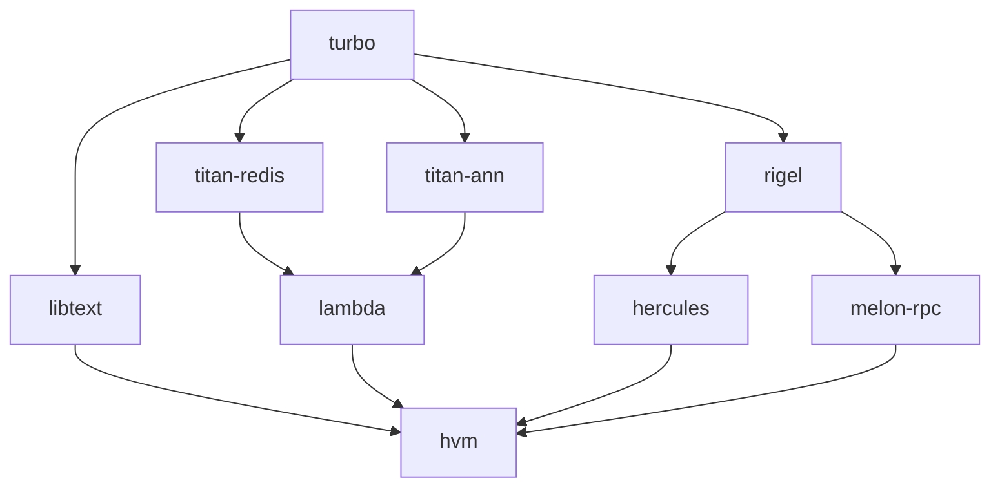
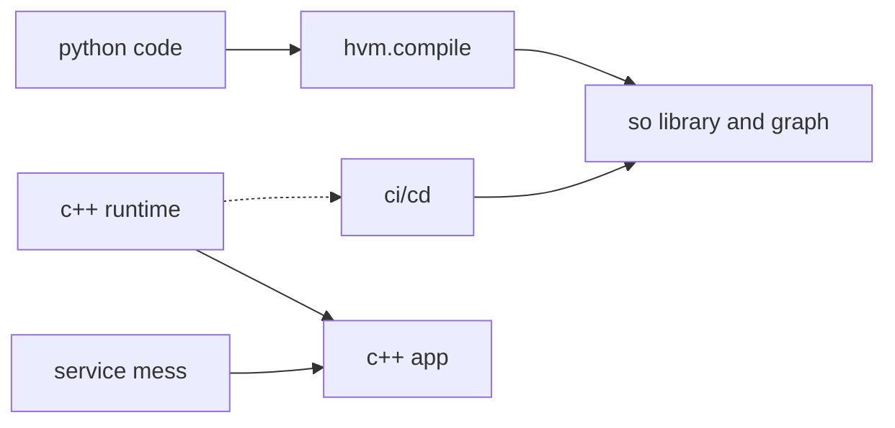
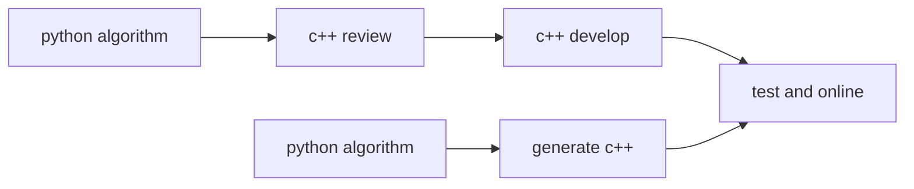

search legend
====

[中文版](README.md)|[English](README_en.md)|[Release Notes](NEWS.md)|[Contributors](contributors.md)


# 端到端搜索

曾经，企业搭建一套搜索系统，出于技术难度、资料完善成都，社区支持，人力资源等各方面的权衡，大多数会选择ES作为
基础，在ES的基础上进一步的开发迭代。不可否认，ES是一款优秀的产品，在不少业务上发挥着重要的作用。然而，ES有着它
固有的限制。工程方面，ES的数据量级能够支撑到10亿级别，数据量再大了，运维、用户体验会收到很大影响。从业务角度来说，比如分词用jieba，粗排用bm25等，在现在nn成熟的时代，搜索的质量已经达不到业务的要求。在ES上继续发力开发插件
的方式也得不偿失。总体来说，用ES搭建初版引擎，可以达到60分的效果。要将分数提高到80分，从ROI的角度来说，并不比
从头搭建一套资源低。

本项目的目的是建立一套**端到端**的搜索框架，可以支撑**百亿**量级,可以达到**80分**的框架系统化。

产品的形态是**开箱即用**,初始，内部集成nn排序，推理，向量召回，特征工程等模块，用户可以在统一的nn接口的基础上，
通过迭代算法，低成本让搜索的质量得到提高。

IR技术是系统的另一个亮点（这项技术受AI编译器的启发），进一步解耦工程与算法，即用户通过python的程序编写业务逻辑，框架会同步自动生成c++代码，以c++程序的方式运行。提升程序的性能，进一步提升产品迭代周期（省去评审、c++开发，c++测试等中间环节）。本项目的主要贡献是高度抽象搜索各个过程的组件，工程侧侧重高性能组件算子开发，算法侧将注意力集中到业务效果，提升沟通质量和效率。

## 作者
* @author Jeff.li
* @email bohuli2048@gmail.com

# 相关子项目

* [turbo](https://github.com/gottingen/turbo.git) 
c++ foundation library.

* [libtext](https://github.com/gottingen/libtext.git) 
chinese segment and normalize library.
* [titan-redis](https://github.com/gottingen/titan-redis.git)
disk storage using redis interface.
* [titan-ann](https://github.com/gottingen/titan-ann.git)
ann search engine base on graph.
* [lambda](https://github.com/gottingen/lambda.git) 
host local search engine for mix term and vector search.
* [rigel](https://github.com/gottingen/rigel.git) 
ai and rpc runtime library, to manage memory and fiber or thread schedule.
* [hercules](https://github.com/gottingen/hercules.git) 
python Aot framework for integrated components interface rpc and ai backend like tesorflow or pytorch
* [hvm](https://github.com/gottingen/hvm.git) (not start now)
framework gateway, let us write python and generate c++ code and run in llvm.
* [tensorflow build](https://github.com/gottingen/tensorflow-build) tensorflow c++ 编译与安装脚本项目
# the goals



it will reduce c++ communication and development phrase during  business development。
may reduce business development days a lot and provide bug free code.

how ever, in some Modularity is not good system, you need to 
do a lot work int `test and online`, it is a very frustrating thing that， if
many people develop together, so fuzz..


inspire by the ai aot. design it write a few python code like below

```python
import hvm

q:str='刘德华'
def do_search(q:tr)->List[Any]
  qp = hvm.QU.parse(q)
  qt = hvm.query.boolen_query
  sq = hvm.query.term_query(qp)
  sq.must('title')
  qt.add_sub_query(sq)
  searcher  = hvm.search
  searcher.set_relavece('bm25')
  searcher.set_ranker('dw_fm')
  searcher.set_l1_sort('default')
  searcher.set_l2_sort('ctr_pri_sorter')
  result = searcher.search(engine)
  return result
hvm.compile(do_search, "./search_demo")
```
at c++ side,
```c++
hvm::Session session;
bool rs = session.load("./search_demo")
if(!rs){
    return false;
}      
string query;
session.run(query);
```
so it can do things in c++ code,Enjoy the joy brought by c++. and hidden the difficult code 
via c++ and hidden complex service governance logic behind.

# nlp roadmap

# Table of contents
* [开发准备准备](ch-00/README.md)
  * [conda guide](ch-00/conda_guide.md)
  * [cmake guide](ch-00/cmake_guide.md) 待完成
  * [bazel guide](ch-00/bazel_guide.md) 待完成
* [工程基础](pf/README.md)
  * [tensorflow 工程化](tf210/tf_project/README.md)
    * [tensorflow 编译安装](tf210/tf_project/compile.md)
    * [简易安装](tf210/tf_project/simple_install.md)
  * [tensorflow 源码分析](tf210/index.ipynb)
    * [tensor--张量](tf210/tf_reading/tensor.md)
    * [内存分配器](tf210/tf_reading/allocator.md)
    * [资源管理器](tf210/tf_reading/resouce.md)
    * [算子定义](tf210/tf_reading/op.md)
    * [算子实现](tf210/tf_reading/kernel.md)
    * [图节点](tf210/tf_reading/node.md)
    * [图定义](tf210/tf_reading/graph.md)
    * [设备](tf210/tf_reading/device.md)
    * [函数](tf210/tf_reading/function.md)
    * [形状判断](tf210/tf_reading/shape_inference.md)
    * [运行时设备](tf210/tf_reading/runtime_device.md)
    * [运行时执行器](tf210/tf_reading/runtime_executor.md)
    * [运行时session](tf210/tf_reading/session.md)
    * [运行时direct session](tf210/tf_reading/runtime_direct_session.md)
    * [xla](tf210/tf_reading/xla.md)
  * 基础库
    * [项目发布约束](pf/base_rules/README.md)
    * [跨平台]() 待完成
    * [单元测试]() 待完成
    * [string类]() 待完成
    * [容器类]() 待完成
  * 内存 & cpu
    * [cpu 缓存]() 待完成
    * [numa]() 待完成
    * [内存池]() 待完成  
  * 多线程
    * [任务调度]() 待完成
    * [smp]() 待完成
    * [读优化]() 待完成
    * [写优化]() 待完成
    * [多协程]() 待完成
* [机器学习基础](dl/index.ipynb)
  * 算法
    * [线性回归](dl/linear/index.ipynb)
    * [数学符号](dl/math_index.ipynb)
    * [线性回归](dl/linear/index.ipynb)
    * [感知机](dl/multilayer_perceptrons/index.ipynb)
    * [深度学习计算](dl/deep_learning_computation/index.ipynb)
    * [卷积神经网络](dl/convolutional_neural_networks/index.ipynb)
    * [现代卷积神经网络](dl/convolutional_modern/index.ipynb)
    * [循环神经网络](dl/recurrent_neural_networks/index.ipynb)
    * [现代神经网络](dl/recurrent_modern/index.ipynb)
    * [注意力机制](dl/attention_mechanisms/index.ipynb)
    * [优化算法](dl/optimization/index.ipynb)
    * [计算性能](dl/computational_performance/index.ipynb)
    * [自然语言处理：预训练](dl/natural_language_processing_pretraining/index.ipynb)
    * [自然语言处理：应用](dl/natural_language_processing_applications/index.ipynb)
  * 机器学习框架
    * [机器学习框架](dl/framework/index.ipynb)
    * [计算图](dl/graph/index.ipynb)
    * [ai编译器](dl/compiler/index.ipynb) 待完成
    * [数据处理框架]() 待完成
    * [分布式训练]() 待完成
    * [模型部署]() 待完成
  * 工程实践
    * [c++ && python]() 待完成
    * [tensorflow专题]() 待完成
    * [tensorflow serving部署]() 待完成
    * [triton inference server]() 待完成
    * [GPU编程]() 待完成
    * [IR专题]() 待完成
  * 扩展资料
    * [扩展阅读](dl/readings.ipynb)
* [Significance of search system](ch-01/README.md)
  * [What problem does search solve](ch-01/search_solv.md)
  * [1.2 搜索的发展历史](ch-01/search_develop.md)

* [搜索导流](diversion/index.ipynb)
  * [提示词](diversion/sug.ipynb)
  * [相关搜索](diversion/rel_search.ipynb)

* [2 搜索架构](ch-02/README.md)
  * [2.1 整体架构](ch-02/arch_total.md)
  * [2.2 搜索的引流](ch-02/stream.md)
  * [2.2 搜索的评估](ch-02/evolate.md)
* [引擎内核设计](ch-11/README.md) [lambda engine](https://github.com/gottingen/lambda.git)
  * [table struct](ch-11/table_struct.md)
  * [11.2 向量引擎]
  * [11.3 term引擎]
  * [11.4 融合索引]
  * [11.5 query语法]
  * [11.6 引擎同步]
  * [11.7 实时引擎]
  * [11.8 存储引擎]
  * [11.9 拉链归并]
* [3 query理解](qu/README.md)
  * [3.1 分词](qu/seg/README.md)
  * [3.2 纠错]
  * [3.3 改写]
  * [3.4 实体识别]
  * [3.5 意图]
  * [3.6 默认词]
  * [3.7 提示词]
* [4. 召回](ch-04/README.md)
  * [4.1 倒排]
  * [4.2 正排]
* [5. 排序](ch-05/README.md)
  * [5.1 粗排](ch-05/cpai.md)
  * [5.2精排](ch-05/jpai.md)
* [6. 搜索系统]
  * [6.1 搜索控制]
  * [6.2 缓存系统]
  * [6.3 索引分层]
  * [6.4 干预系统]
  * [6.5 特征收集]
  * [6.6 离线计算]
  * [6.7 存储系统]
* [7. 服务治理]
  * [7.1 微服务]
  * [7.2 多机房]
  * [7.3 多集群]
  * [7.4 实时数据]
  * [7.5 服务降级与容灾]
* [8. 开发预备]
  * [8.1 cmake使用]
  * [8.2 conda集成]
* [9. 设计分析]
  * [9.1 query理解]
  * [9.2 实时同步]
  * [9.3 引擎]
  * [9.4 rank]
  * [9.5 干预]
  * [9.6 A/B试验]
* [10. 系统实现]
  * [10.1 模块分解]
  * [10.2 基础库]
  * [10.3 算子库]
  * [10.4 rpc通信]
  * [10.5 存储引擎]
  * [10.6 同步协同]
* [12 qu模块实现]
  * [12.1 标准化]
  * [12.2 分词]
  * [12.3 纠错]
  * [12.4 改写]
  * [12.5 实体识别]
  * [12.6 意图识别]
* [13 rank]
  * [相关性]
  * [实效性]
  * [权威性]
  * [ctr]
* [14 ir新架构]
  * [14.1 机器学习编译]
  * [14.2 python与c++]
  * [14.3 在线dag]
  * [14.3 llvm ir]
* [15 向量引擎]
  * [15.1 向量引擎需求]
  * [15.2 向量算法]
  * [15.3 向量引擎对比]
  * [15.4 向量引擎与生产环境]
* [16 机器学习平台]
  * [16.1 数据并行]
  * [16.2 模型并行]
  * [16.3 参数服务器]
  * [16.4 horovod]
  * [16.5 分布式并行-mpi]
    * [16.5.1 gloo]
    * [16.5.2 openmpi]
* [17 技术需求]
  * [17.1 高并发原子操作]
  * [17.2 双buffer与rcu]
  * [17.3 simd高性能计算]
  * [17.4 fiber and eventloop]
  * [17.5 内存分配与内存池]
  * [17.6 gpu计算]
  * [17.7 dpdk与大模型]
  * [17.8 rdma]
  * [17.9 nccl通信]
  * [17.10 numa与任务调度]
* [18 机器学习框架]
  * [18.1 机器学习框架]
  * [18.2 tensorflow算子开发]
  * [18.3. tensorflow model]
  * [18.4 xla]
* [19 特征工程]