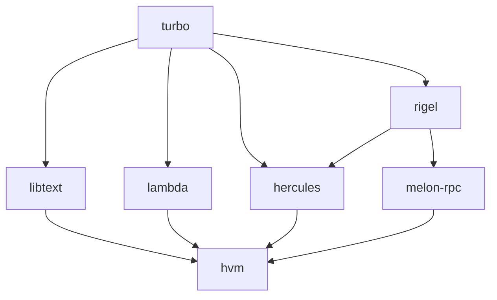
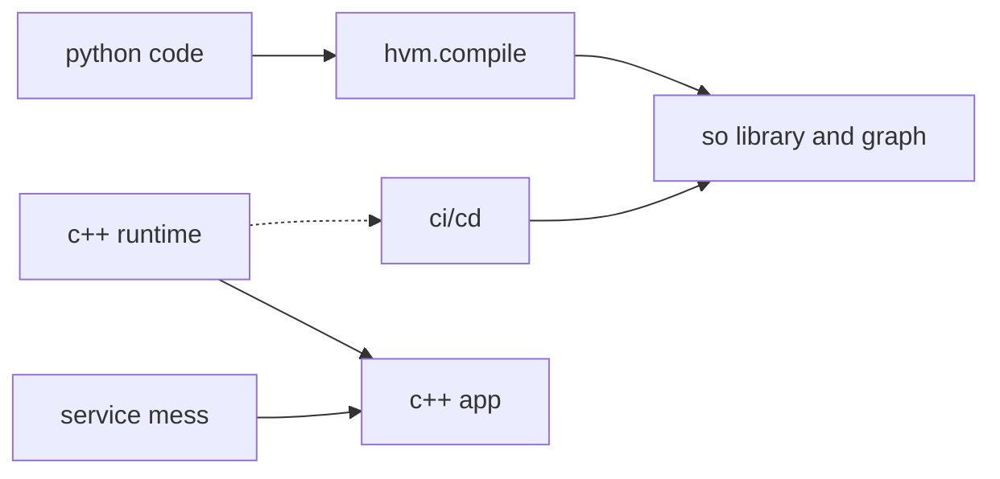
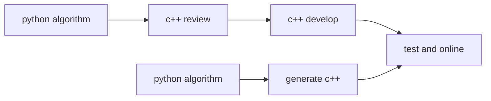

search legend
====

[中文版](README_cn.md)|[Release Notes](NEWS.md)|[Contributors](contributors.md)


# what it is?

In 2023 or the second half of 2022, after
several years of dormancy, the big model finally 
showed his powerful ability to the world in the 
form of chatgpt. This project is the entry project of 
the Gottingen organization, which aims to introduce how 
to implement a search system and provide a suitable way
to access the components of the large model. The project
takes engineering realization and actual landing projects 
as the main line, and gradually explains the principle, 
design and function of the system.

## Technical discussions
* @author Jeff.li
* @email lijippy@163.com
* @weichat: jeffli1024

# reference project

* [turbo](https://github.com/gottingen/turbo.git) 
c++ foundation library.

* [libtext](https://github.com/gottingen/libtext.git) 
chinese segment and normalize library.
* [lambda](https://github.com/gottingen/lambda.git) 
host local search engine for mix term and vector search.
* [rigel](https://github.com/gottingen/rigel.git) 
ai and rpc runtime library, to manage memory and fiber or thread schedule.
* [hercules](https://github.com/gottingen/hercules.git) 
python Aot framework for integrated components interface rpc and ai backend like tesorflow or pytorch
* [hvm](https://github.com/gottingen/hvm.git) (not start now)
framework gateway, let us write python and generate c++ code and run in llvm.

# the goals



it will reduce c++ communication and development phrase during  business development。
may reduce business development days a lot and provide bug free code.

how ever, in some Modularity is not good system, you need to 
do a lot work int `test and online`, it is a very frustrating thing that， if
many people develop together, so fuzz..


inspire by the ai aot. design it write a few python code like below

```python
import hvm

q:str='刘德华'
def do_search(q:tr)->List[Any]
  qp = hvm.QU.parse(q)
  qt = hvm.query.boolen_query()
  sq = hvm.query.term_query(qp)
  sq.must('title')
  qt.add_sub_query(sq)
  searcher  = hvm.search()
  searcher.set_relavece('bm25')
  searcher.set_ranker('dw_fm')
  searcher.set_l1_sort('default')
  searcher.set_l2_sort('ctr_pri_sorter')
  result = searcher.search(engine)
  return result
hvm.compile(do_search, "./search_demo")
```
at c++ side,
```c++
hvm::Session session;
bool rs = session.load("./search_demo")
if(!rs){
    return false;
}      
string query;
session.run(query);
```
so it can do things in c++ code,Enjoy the joy brought by c++. and hidden the difficult code 
via c++ and hidden complex service governance logic behind.

# Table of contents
* [develop environment prepare](ch-00/README.md)
  * [conda guide](ch-00/conda_guide.md)
  * [cmake guide](ch-00/cmake_guide.md)
* [Significance of search system](ch-01/README.md)
  * [What problem does search solve](ch-01/search_solv.md)
  * [1.2 搜索的发展历史](ch-01/search_develop.md)
* [2 搜索架构](ch-02/README.md)
  * [2.1 整体架构](ch-02/arch_total.md)
  * [2.2 搜索的引流](ch-02/stream.md)
  * [2.2 搜索的评估](ch-02/evolate.md)
* [3 query理解](ch-03/README.md)
  * [3.1 分词](ch-03/segment.md)
  * [3.2 纠错](ch-03/currect.md)
  * [3.3 改写](ch-03/rewrite.md)
  * [3.4 实体识别](ch-03/ner.md)
  * [3.5 意图](ch-03/intend.md)
  * [3.6 默认词](ch-03/default.md)
  * [3.7 提示词](ch-03/sug.md)
* [4. 召回](ch-04/README.md)
  * [4.1 倒排]()
  * [4.2 正排]()
* [5. 排序](ch-05/README.md)
  * [5.1 粗排](ch-05/cpai.md)
  * [5.2精排](ch-05/jpai.md)
* [6. 搜索系统]()
  * [6.1 搜索控制]()
  * [6.2 缓存系统]()
  * [6.3 索引分层]()
  * [6.4 干预系统]()
  * [6.5 特征收集]()
  * [6.6 离线计算]()
  * [6.7 存储系统]()
* [7. 服务治理]()
  * [7.1 微服务]()
  * [7.2 多机房]()
  * [7.3 多集群]()
  * [7.4 实时数据]()
  * [7.5 服务降级与容灾]()
* [8. 开发预备]()
  * [8.1 cmake使用]()
  * [8.2 conda集成]()
* [9. 设计分析]()
  * [9.1 query理解]()
  * [9.2 实时同步]()
  * [9.3 引擎]()
  * [9.4 rank]()
  * [9.5 干预]()
  * [9.6 A/B试验]()
* [10. 系统实现]()
  * [10.1 模块分解]()
  * [10.2 基础库]()
  * [10.3 算子库]()
  * [10.4 rpc通信]()
  * [10.5 存储引擎]()
  * [10.6 同步协同]()
* [11 引擎实现]()
  * [11.1 多阶段打分]()
  * [11.2 向量引擎]()
  * [11.3 term引擎]()
  * [11.4 融合索引]()
  * [11.5 query语法]()
  * [11.6 引擎同步]()
  * [11.7 实时引擎]()
  * [11.8 存储引擎]()
  * [11.9 拉链归并]()
* [12 qu模块实现]()
  * [12.1 标准化]()
  * [12.2 分词]()
  * [12.3 纠错]()
  * [12.4 改写]()
  * [12.5 实体识别]()
  * [12.6 意图识别]()
* [13 rank]()
  * [相关性]()
  * [实效性]()
  * [权威性]()
  * [ctr]()
* [14 ir新架构]()
  * [14.1 机器学习编译]()
  * [14.2 python与c++]()
  * [14.3 在线dag]()
  * [14.3 llvm ir]()
* [15 向量引擎]()
  * [15.1 向量引擎需求]()
  * [15.2 向量算法]()
  * [15.3 向量引擎对比]()
  * [15.4 向量引擎与生产环境]()
* [16 机器学习平台]()
  * [16.1 数据并行]()
  * [16.2 模型并行]()
  * [16.3 参数服务器]()
  * [16.4 horovod]()
  * [16.5 分布式并行-mpi]()
    * [16.5.1 gloo]()
    * [16.5.2 openmpi]()
* [17 技术需求]()
  * [17.1 高并发原子操作]()
  * [17.2 双buffer与rcu]()
  * [17.3 simd高性能计算]()
  * [17.4 fiber and eventloop]()
  * [17.5 内存分配与内存池]()
  * [17.6 gpu计算]()
  * [17.7 dpdk与大模型]()
  * [17.8 rdma]()
  * [17.9 nccl通信]()
  * [17.10 numa与任务调度]()
* [18 机器学习框架]()
  * [18.1 机器学习框架]()
  * [18.2 tensorflow算子开发]()
  * [18.3. tensorflow model]()
  * [18.4 xla]()
* [19 特征工程]()