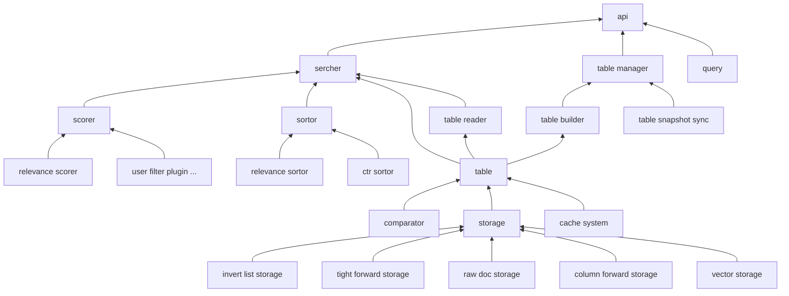

engine design
===

# what it to be
lambda design to be the kernel of search. analogous to `lucene`, it
provide the most basic search capability. In fact, it provides a 
framework of a basic search engine, and continues to expand upwards
to provide business-customized search services, such as distributed,
fragmented, and replica consistency. Downward, continuously 
optimize optimization components such as scoring components, 
sorting components, and continuously improve local effects.

# architecture

# what is new

traditional search engines, we usually do term recall at by mix sort
and score together.

at this time, The biggest goal is to improve develop iteration efficiency 
in the case of optimal recall.In order to achieve this goal, the 
task is decomposed into two sub-problems of optimal recall and 
maximum improvement of iteration efficiency

# optimal recall
* Vector and term recall are in the same engine to ensure that the 
data is aligned and the scoring data is consistent.
* supports operator down push from upstream Business System. like
booster, filter and so on.
* make engine real time that the, ensure the Effectiveness in seconds span.
 
# develop iteration efficiency

* promote performance philosophical.
* reduce the develop difficuties, Make the API hierarchical and modular.
* Hide the complex logic of service governance into the built-in functions 
of the system
* Make it possible to users which is as convenient as operating a table
system (such as mysql)