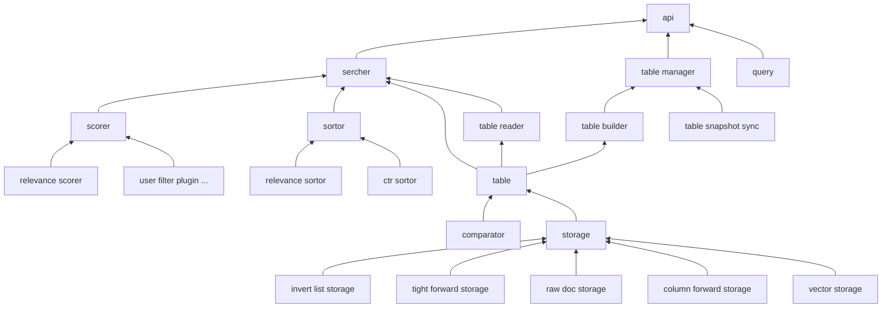

engine design
===

# what it to be
lambda design to be the kernel of search. analogous to `lucene`, it
provide the most basic search capability. In fact, it provides a 
framework of a basic search engine, and continues to expand upwards
to provide business-customized search services, such as distributed,
fragmented, and replica consistency. Downward, continuously 
optimize optimization components such as scoring components, 
sorting components, and continuously improve local effects.

# architecture

