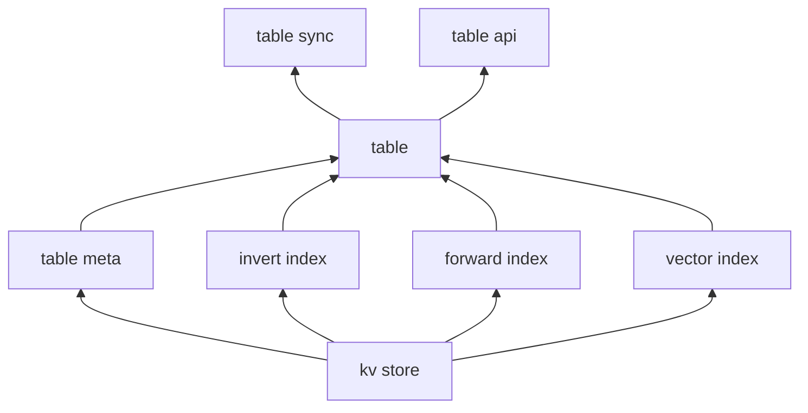

table struct
===

# architecture

```mermaid
graph BT
        
    A[table]
    B[table meta]
    C[invert index]
    D[forward index]
    E[vector index]
    F[kv store]
    G[table sync]
    F-->B
    F-->D
    F-->C
    F-->E
    B-->A
    C-->A
    D-->A
    E-->A
    A --> G
    A --> H[table api]
```