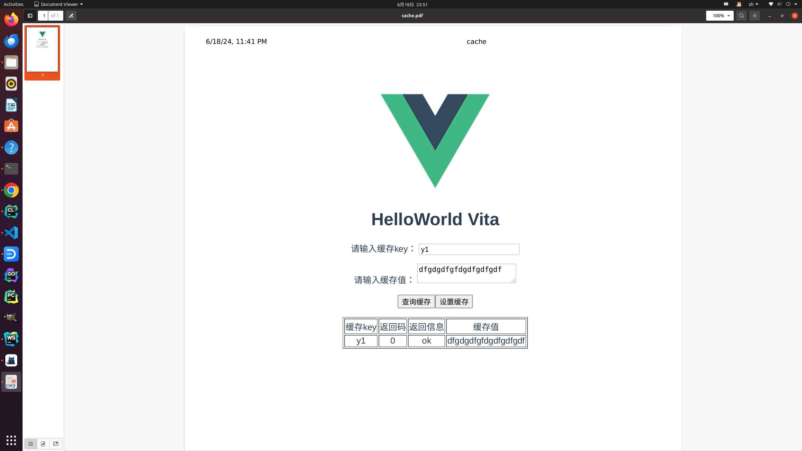

a006 hala vue
==============================

本节要点:

* http web server 工作流程
* restful 缓存服务搭建
* vue 前端服务搭建
* melon 搭建简易web服务
* 通过浏览器访问服务

在前面的章节中，我们已经完成了一个简单的restful服务，这个服务可以通过浏览器访问，也可以通过客户端访问，这个服务是一个简单的echo服务，返回
客户端的请求。在这一节中，我们将继续深入，实现一个简单的缓存服务，这个服务可以设置和获取缓存，这个服务是一个简单的restful服务，我们将
通过浏览器访问这个服务，同时，我们将通过vue框架，实现一个简单的前端服务，通过浏览器访问这个前端服务，来访问我们的缓存服务。

本来这篇文章应该是昨天更新，在演示时，总是在命令行展示，这样不太直观，一咬牙，决定尝试一下通过浏览器进行交互演示，这样更加直观。不幸的是，我
从未接触过前端，对前端一窍不通。确实也还有一些挑战。于是我梳理一下思路，前端需要解决什么问题。

**第一步**
* 通过文本框输入数据，获取key和value和restful接口交互。
* 有一个按钮，点击按钮，将获取到的数据发送到restful接口，并得到返回值。
* js中调用http模块，发起http请求，获取返回值。

**第二步**
* vue项目该如何部署和编写，前端独立部署，还是在c++中写入前端代码。
经过调研nginx部署vue项目的方式，只要启动一个文件服务器，将vue项目部署到文件服务器目录下，就可以通过浏览器访问vue项目。

幸运的是，经过一天的学习，终于解决了一个历史级别的问题的`hello world`问题，本项目的前端部分，属于`toy`级别，只是为了演示，
如果要在实际生产环境中使用，简易请专业的前端工程师进行优化和开发。

当然，前端的部署，可以通过`nginx`部署，但这并不是我们想要的，毕竟多维护一个`nginx`服务，对于我们来说，是一个负担，我们希望
通过`melon`服务，将前端服务和后端服务一起部署，这样，我们只需要维护一个服务，就可以了。

这在melon中是可以很快实现，当然还有一些小细节需要处理。
* js文件需要将`content-type`设置为`application/javascript`，否则浏览器不会解析js文件。
* vue项目需要将返回值时的`content-type`设置为`application/json`，否则vue项目无法解析返回值。
* `Access-Control-Allow-Origin`需要设置为`*`，否则浏览器会拒绝访问。

本节代码仓库位于[hallo-ea-06][1]

创建项目等初始化过程前面已经演示过多次，从本节开始，创建项目过程不再详细描述。

# 服务说明
这个项目用到 `vue`前端工程，已经源码在`cache`目录下，生成的前端工程在`cache/dist`目录下，拷贝到`a006-hala-vue`目录下`www`目录中。
在编译过程中会拷贝到`build`目录下。

项目会对外提供两类服务，缓存接口和前端接口，缓存接口是一个简单的restful服务，前端接口是一个vue前端服务。
* 缓存接口 访问 `http://localhost:8018/ea/cache` 是一个restful服务，用于设置和读取缓存数据。
* 前端接口 访问 `http://localhost:8018/ea/ui` 是一个vue前端服务，浏览器访问这个服务，可以访问缓存服务。

## 缓存服务

### 设置缓存

http post 请求 `http://localhost:8018/ea/cache？key=abc` 设置缓存数据，数据为请求的body数据。
返回数据为json格式，`{"code":0, "msg":"ok"， "value":""}`value字段始终为空。

### 读取缓存

http get 请求 `http://localhost:8018/ea/cache？key=abc` 读取缓存数据，数据为请求的body数据。
返回数据为json格式，`{"code":0, "msg":"ok"， "value":"abc"}`value字段为缓存数据。
如果数据不存在等情况，返回数据为json格式，code为非0，msg为错误信息，value为空。

## 前端服务

前端服务是一个vue前端服务，本质上一个文件服务器，浏览器请求的路径，映射到本地的 `vue`前端工程目录 `www`。
比如
* 请求 `http://localhost:8018/ea/ui`，映射到本地的 `www`目录下的 `index.html`文件。
* 请求 `http://localhost:8018/ea/ui/css/app.css`，映射到本地的 `www`目录下的 `css/app.css`文件。

由于本节的内容稍微的有一些多并且涉及到前后端，本节介绍如何编译和运行项目。下一节将介绍代码的实现。

# 编译运行

编译
```shell
mkdir build
cd build
cmake ..
make
```

运行
```shell
./halavue/halavue
```

打开浏览器，访问 `http://localhost:8018/ea/ui`，可以看到前端页面。

如图：



通过设置文本框，点击按钮，可以设置缓存数据，通过读取文本框，点击按钮，可以读取缓存数据。

下一节，我们将介绍代码的实现。

[1]: https://github.com/gottingen/ea-half-an-hour/tree/master/a006-hala-vue
