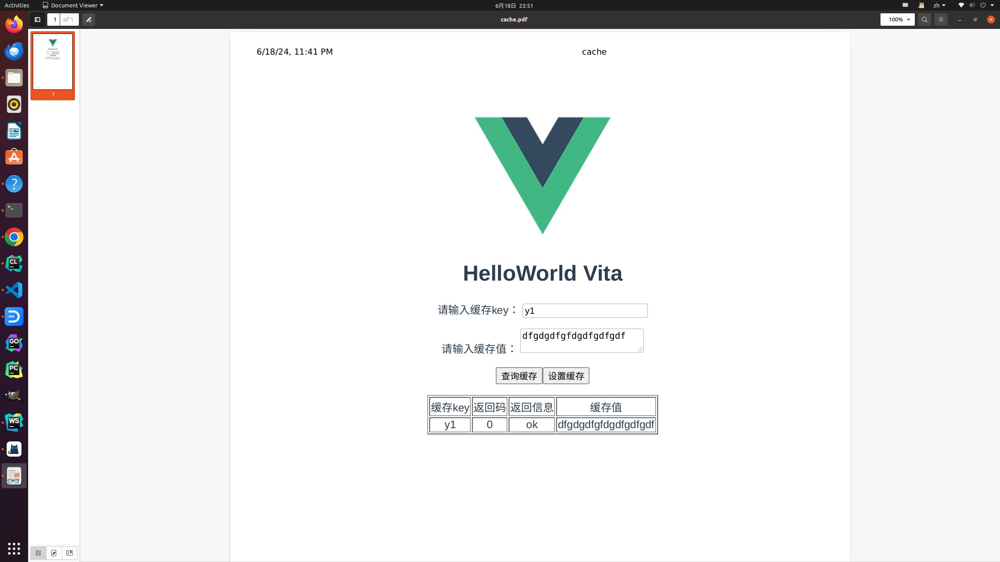

a006 hala kv
==============================

本节要点:

* 统一`kv`存储接口，使用`protobuf`定义`kv`存储接口的数据结构
* cache模块独立出`kv`存储接口和实例，protobuf服务和restful服务作为代理层，不维护`kv`存储实例

本节代码仓库位于[hallo-ea-08][1]

# 编译运行

本节内容，基于继承了前面几节的内容和部分代码，比较基础的操作，如创建项目，安装依赖等，不再详细描述。我们先从
效果开始。

## 编译

```shell
mkdir build
cd build
cmake ..
make
```

## 运行

**启动server**

```shell
./halakv/kv_server
```

**浏览器访问**
打开浏览器，访问 `http://localhost:8018/ea/ui`，可以看到前端页面。



在文本框中输入`key`和`value`，点击`set`按钮，可以设置`key`和`value`的缓存数据，点击`get`按钮，可以读取`key`的缓存数据。

**客户端访问**

```shell
./halakv/kv_client --op set --key abc --value 123
./halakv/kv_client --op get --key abc
```

此时，可以在客户端看到返回的数据。

在浏览器和客户端，可以交替的设置和读取缓存数据。比如在浏览器中设置数据，在客户端读取数据，或者在客户端设置数据，在浏览器中读取数据。

目前实现的`kv server`功能不是很复杂，提供kv的 set， get， remove接口，我们的目标是通过这个服务，展示该如何使用`EA`的基础设施，快速的
实现一个用于生产环境的应用。可以通过多种交互方式与服务交互，适用不同的场景：

* 线上c++服务，通过 `protobuf` + `melon`与`kv server`交互，性能高，使用简单。
* 线上其他语言服务， 通过了`http` + `protobuf`与`kv server`交互，性能高。
* 线上其他语言服务， 通过了`http` + `restful`，body为 `json` 与`kv server`交互，性能低，使用简单，方便调试。
* 调试线kv服务数据，通过浏览器，设置与查询数据，直观的观察线上数据情况。

# 源码解读

`hala kv`的源码，可以分为四个部分：

* `proto`文件，定义接口的数据结构和服务的访问接口， `kv.proto`。
* 服务端实现，kv缓存服务 `server.cc` `cache.cc` `kv_service.cc` `restful_service.cc` `web_service.cc`
* 客户端实现，本例子是一个命令行客户端 `client.cc`
* 前端Vue界面。 `cache` 文件夹下的前端代码。

## proto文件

```protobuf
syntax="proto2";
package halakv;

option cc_generic_services = true;

message KvRequest {
      required string key = 1;
      optional string value = 2;
};

message KvResponse {
      required int32 code = 1;
      required string message = 2;
      optional string value = 3;
};

service KvService {
      rpc set(KvRequest) returns (KvResponse);
      rpc get(KvRequest) returns (KvResponse);
      rpc remove(KvRequest) returns (KvResponse);
};
```

proto文件定义了`kv`服务的请求和响应数据结构，以及`kv`服务的接口。这种风格的定是，数据相同，通过不同的接口访问，可以提高服务的灵活性。
还有另外一种风格，接口相同，通过不同的数据结构类型，访问不同的服务。使用场景不同，在后面介绍raft，sirius服务时会用到这种风格的定义。

## 服务端实现

服务端的实现与a006的实现有些很多类似的之处，但是在设计上有很大的不同：

a006中，对cache的增删改查操作，是在restful服务中实现，本例中，对kv的增删改查操作，在cache类中实现，restful服务成为代理层。
新增加的proto服务，也同样是代理层，在实现具体的kv操作时，调用cache类的接口。

web与a006没有变化，还是通过vue前端服务，与restful服务交互。这里不再详细描述。

### kv_service.cc

```cpp
#include <halakv/kv_service.h>
#include <halakv/cache.h>

namespace halakv {

    void KvServiceimpl::set(::google::protobuf::RpcController *cntl_base,
                            const ::halakv::KvRequest *request,
                            ::halakv::KvResponse *response,
                            ::google::protobuf::Closure *done) {
        melon::ClosureGuard done_guard(done);
        _cache->put(request, response);
    }

    void KvServiceimpl::get(::google::protobuf::RpcController *cntl_base,
                            const ::halakv::KvRequest *request,
                            ::halakv::KvResponse *response,
                            ::google::protobuf::Closure *done) {
        melon::ClosureGuard done_guard(done);
        _cache->get(request, response);
    }

    void KvServiceimpl::remove(::google::protobuf::RpcController *cntl_base,
                            const ::halakv::KvRequest *request,
                            ::halakv::KvResponse *response,
                            ::google::protobuf::Closure *done) {
        melon::ClosureGuard done_guard(done);
        _cache->remove(request, response);
    }

}  // namespace halakv
```

`kv_service.cc`实现了`kv`服务的接口，实现了`set`，`get`，`remove`接口，这些接口的实现，调用了`cache`类的接口。
KvServiceimpl类也并不维护任何对象的生命周期，只是调用cache类的接口，cache类的实现，维护了kv的数据。

### cache.cc

```cpp
#include <halakv/cache.h>

namespace halakv {

    turbo::Status Cache::init(int capacity) {
        _cache = std::make_unique<turbo::LRUCache<std::string, std::string>>(capacity);
        return turbo::OkStatus();
    }

    void Cache::put(const halakv::KvRequest *request, halakv::KvResponse *response) {
        if(!request->has_value()) {
            response->set_code(static_cast<int>(turbo::StatusCode::kInvalidArgument));
            response->set_message("no value");
            return;
        }
        _cache->put(request->key(), request->value());
        response->set_code(static_cast<int>(turbo::StatusCode::kOk));
        response->set_message("ok");
    }

    void Cache::get(const halakv::KvRequest *request, halakv::KvResponse *response) const {
        auto r = _cache->try_get(request->key());
        if (r.second) {
            response->set_value(*r.first);
            response->set_code(static_cast<int>(turbo::StatusCode::kOk));
            response->set_message("ok");
        } else {
            response->set_code(static_cast<int>(turbo::StatusCode::kNotFound));
            response->set_message("not found");
        }
    }

    void Cache::remove(const halakv::KvRequest *request, halakv::KvResponse *response) {
        auto r = _cache->try_get(request->key());
        if (r.second) {
            response->set_value(*r.first);
            response->set_code(static_cast<int>(turbo::StatusCode::kOk));
            response->set_message("ok");
            _cache->remove(request->key());
        } else {
            response->set_code(static_cast<int>(turbo::StatusCode::kNotFound));
            response->set_message("not found");
        }
    }

}  // namespace halakv
```

`cache.cc`实现了`cache`类的接口，实现了`put`，`get`，`remove`接口，这些接口的实现，调用了`LRUCache`类的接口。
设置返回值时，需要注意,response的message字段，在proto定义是required，必须设置。

restful与a006相比，去除掉了kv的增删改查操作，只保留了代理层，在处理response时，将protobuf的数据结构转换为json数据结构。

```c++
#include <halakv/restful_service.h>
#include <turbo/strings/substitute.h>
#include <turbo/strings/match.h>
#include <melon/json2pb/pb_to_json.h>
#include <collie/nlohmann/json.hpp>
#include <halakv/kv.pb.h>

namespace halakv {

    static std::string proto_conversion_err;
    static std::string no_key_err;
    std::once_flag proto_conversion_err_flag;

    void init_error_once() {
        nlohmann::json j;
        j["code"] = turbo::StatusCode::kInternal;
        j["msg"] = "proto to json error";
        j["value"] = "";
        proto_conversion_err = j.dump();
        nlohmann::json nokey;
        nokey["code"] = turbo::StatusCode::kInvalidArgument;
        nokey["msg"] = "no key or value";
        nokey["value"] = "";
        no_key_err = nokey.dump();
    }

    const std::string &get_proto_conversion_err() {
        std::call_once(proto_conversion_err_flag,init_error_once);
        return proto_conversion_err;
    }

    const std::string &get_nokey_err() {
        std::call_once(proto_conversion_err_flag,init_error_once);
        return proto_conversion_err;
    }

    static constexpr std::string_view kTemplate = R"({"code":$0,"msg":"$1", "value":"$2"})";

    void CacheService::process(const melon::RestfulRequest *request, melon::RestfulResponse *response) {
        auto &path = request->unresolved_path();
        response->set_header("Access-Control-Allow-Origin", "*");
        // index
        if (path.empty()) {
            response->set_status_code(200);
            response->set_header("Content-Type", "text/html");
            response->set_body(R"(
<!DOCTYPE html>
<html lang="en">
<head>
    <meta charset="UTF-8">
    <title>Cache Service</title>
</head>
<body>
    <br> <a href="/ea/cache">cache</a> </br>
    <br> <a href="/ea/ui">ui</a> </br>
</body>
</html>
            )");
            return;
        }
        if (turbo::starts_with(path, "ui")) {
            _web_service->process(request, response);
            return;
        }
        if (path != "cache") {
            response->set_status_code(404);
            response->set_body("not found");
            return;
        }
        halakv::KvResponse kv_response;
        halakv::KvRequest kv_request;
        response->set_header("Content-Type", "application/json");
        // get method
        if (request->method() == melon::HTTP_METHOD_GET) {
            auto &uri = request->uri();
            auto *key = uri.GetQuery("key");
            if (key == nullptr) {
                response->set_status_code(200);
                kv_response.set_code(static_cast<int>(turbo::StatusCode::kInvalidArgument));
                kv_response.set_value("");
                kv_response.set_message("no key");
                std::string json;
                if (json2pb::ProtoMessageToJson(kv_response, &json)) {
                    response->set_body(json);
                } else {
                    response->set_body(get_proto_conversion_err());
                }
                return;
            }
            // get key from cache
            kv_request.set_key(*key);
            LOG(INFO) << "get key: " << *key;
            _cache_service->get(&kv_request, &kv_response);
            std::string json;
            std::string err;
            response->set_status_code(200);
            if (json2pb::ProtoMessageToJson(kv_response, &json, &err)) {
                LOG(INFO) << "get key: " << *key << "response: " << json;
                response->set_body(json);
            } else {
                LOG(ERROR)<< "error: " << err;
                response->set_body(get_proto_conversion_err());
            }
            return;
        }

        // set method
        if (request->method() == melon::HTTP_METHOD_POST) {
            auto &uri = request->uri();
            auto *key = uri.GetQuery("key");
            auto &value = request->body();
            if (key == nullptr || value.empty()) {
                response->set_status_code(200);
                response->set_body(get_nokey_err());
                return;
            }
            kv_request.set_key(*key);
            kv_request.set_value(value.to_string());
            _cache_service->put(&kv_request, &kv_response);
            response->set_status_code(200);
            std::string json;
            if (json2pb::ProtoMessageToJson(kv_response, &json)) {
                response->set_body(json);
            } else {
                response->set_body(get_proto_conversion_err());
            }
            return;
        }
        response->set_status_code(403);
        response->set_body("{err:not support method}");
    }

}  // namespace halakv
```

``json2pb::ProtoMessageToJson`` 函数，将protobuf的数据结构转换为json数据结构，这个函数是`melon`库提供的，
可以将protobuf的数据结构转换为json数据结构，这样，我们可以通过浏览器访问服务，直接查看数据。

### server.cc

```cpp

#include <melon/rpc/restful_service.h>
#include <halakv/restful_service.h>
#include <halakv/kv_service.h>
#include <halakv/web_service.h>
#include <melon/rpc/server.h>
#include "version.h"
#include <halakv/cache.h>

DEFINE_int32(port, 8018, "TCP Port of this server");
DEFINE_int32(cache_size, 10, "TCP Port of this server");
DEFINE_string(root_path, "www", "TCP Port of this server");
DEFINE_int32(idle_timeout_s, -1, "Connection will be closed if there is no "
                                 "read/write operations during the last `idle_timeout_s'");

DEFINE_string(certificate, "cert.pem", "Certificate file path to enable SSL");
DEFINE_string(private_key, "key.pem", "Private key file path to enable SSL");
DEFINE_string(ciphers, "", "Cipher suite used for SSL connections");


int main(int argc, char* argv[]) {
    google::ParseCommandLineFlags(&argc, &argv, true);
    turbo::setup_color_stderr_sink();
    // Generally you only need one Server.
    melon::Server server;
    halakv::WebServie vue_service(FLAGS_root_path);

    halakv::Cache cache;
    auto rs = cache.init(FLAGS_cache_size);
    if(!rs.ok()) {
        LOG(ERROR) << "init cache failed: " << rs;
        return -1;
    }

    halakv::CacheService cache_service(&cache, &vue_service);
    rs = cache_service.register_server("/ea", &server);
    if(!rs.ok()) {
        LOG(ERROR) << "register server failed: " << rs;
        return -1;
    }

    halakv::KvServiceimpl kv_service(&cache);
    if(server.AddService(&kv_service,melon::SERVER_DOESNT_OWN_SERVICE) != 0) {
        LOG(ERROR) << "Fail to add kv service";
        return -1;
    }
    melon::ServerOptions options;
    options.idle_timeout_sec = FLAGS_idle_timeout_s;
    //options.mutable_ssl_options()->default_cert.certificate = FLAGS_certificate;
    //options.mutable_ssl_options()->default_cert.private_key = FLAGS_private_key;
    //options.mutable_ssl_options()->ciphers = FLAGS_ciphers;
    if (server.Start(FLAGS_port, &options) != 0) {
        LOG(ERROR) << "Fail to start HttpServer";
        return -1;
    }
    server.RunUntilAskedToQuit();
    return 0;
}
```
server.cc中，注册了`kv`服务，`cache`服务，`vue`服务，`cache`服务和`vue`服务是代理层，`kv`服务是实现层。
相比于a006，增加了KvServiceimpl的初始化，前面提到，CacheService restful服务和KvServiceimpl服务是代理层，不维护对象生命周期，
这里可以看到，他们调用的对象 `cache`的生命周期是由 `main`函数维护，当时也可以用单例等方式维护。

# 总结

单机的kv服务，到此为止，已经全部实现。只要对服务的协议和接口稍微有所调整，即可改造成为一个终端的服务。

# 思考提示

* 对象的生命周期，如何管理？
* 如何解耦服务的实现和服务的代理层？

# 下回预告

下一节，我们在单机服务的基础上，继续扩展，实现一个分布式kv服务。

[1]: https://github.com/gottingen/ea-half-an-hour/tree/master/a008-hala-kv