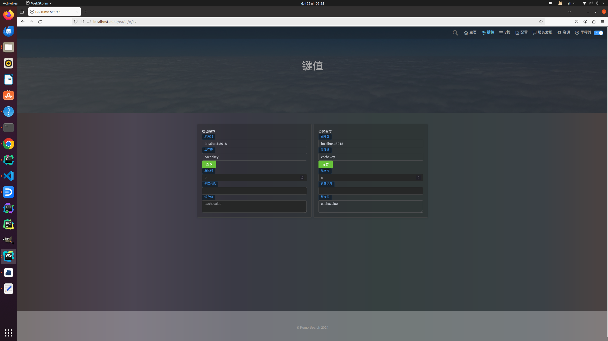

a009 hala dkv
============================

本节要点:

* 分布式kv架构设计
* 代理模式设计

a008小节中，我们实现了一个单机kv服务，这个服务是一个非常简单的kv服务，只能在一个节点上运行，在实际生产环境中，单机的服务难以满足大数据量的
存储需求，因此我们需要一个分布式的kv服务，这个服务可以在多个节点上运行，数据可以分布在多个节点上，这样可以提高数据的存储量，提高数据的读写
性能，提高数据的可靠性。

分布式的架构设计是一个非常复杂的问题，需要考虑很多因素，比如数据的分布，数据的一致性，数据的可靠性，数据的读写性能，数据的扩展性等等。
实际产品中，分布式也有多种实现方式，比如一致性哈希，基于中心节点，有序节点等等。这里我们使用一种最朴素的hash架构，根据key的hash值，将数据
分布在对应的节点上。在实际环境中这种结构也是最实用的，因为这种结构简单，容易实现，容易维护。

当然在一些产品化的存储中，会使用更为严谨的架构:

* cassandra 使用了一致性哈希以及gossip协议，保证数据的一致性，可靠性。
* redis 使用了一主多从的架构，结合一致性哈希，保证数据的一致性，可靠性。
* hbase 基于中心节点的架构，保证数据的一致性，可靠性。

对于业务服务而言，并不能像上面的产品那样，把精力集中到基础设施上，我们可以使用多集群，多副本的方式，保证数据的一致性，可靠性。同时在业务的服务
上，压力最大的点还是在业务逻辑的快速开发、服务的快速迭代、服务的快速部署、服务的快速上线。因此我们在设计分布式服务的时候，需要考虑到业务的快速
迭代，快速上线，快速部署，快速开发。虽然这些看起来是矛盾的，但是在实际业务中，我们需要权衡这些因素，找到一个平衡点。

像上面的成熟产品，也是经过多年的沉淀和打磨，才有了今天产品的稳定性和可靠性，而就架构本身而言，不仅仅学习成本很高，运维也需要专业的维护人员。这在
业务开发是很危险的。


那么，如何设计一个简单的分布式kv服务呢？我们显然要先对自己提点要求：

* 架构尽量简单，易于实现，易于维护。
* 架构的升级扩展，与客户端解耦合。

基于上面的要求，我们设计一个简单的分布式kv服务，这个服务可以有任意多的节点，数据通过hash算法分布在各个节点上，每个节点都是一个kv服务，提供
get，set，del等操作。每个节点同时也是一个代理，代理可以将请求转发到其他节点上，这样就实现了一个简单的分布式kv服务。客户端访问任意一个节点，
都可以访问到数据，这样就实现了一个简单的分布式kv服务。

这样设计的好处是：

* 架构足够简单，易于实现，易于维护。
* 将代理层集成到节点中，与客户端解耦合。相比传统的分片服务，实际上我们仅仅是多做一件事情，将代理层集成到节点中。但是带来的是，客户端不需要
  知道具体的节点，只需要知道一个节点，就可以访问到所有的数据。客户端在集成时，可以用vip，dns，服务发现等各种方式进行负载均衡等等方式进行访问。
  数据分布的算法内聚到分布式系统中，对客户端透明。

# 编码

本节的源码继承了a008小节的源码，我们在a008的基础上，增加了分布式kv服务的代码，这里我们只讨论分布式kv服务的代码。

代码的设计，细心的你会发现，我们越来越强调设计模式，这是因为在实际的业务开发中，设计模式是非常重要的，比如上面的设计，与传统的设计
改动不大，但是带来的好处是巨大的。设计模式是一种思维方式，是一种解决问题的方式，是一种优化的方式，是一种提高代码质量的方式。在实际的
业务开发中，设计模式是非常重要的，是非常有价值的。

a008小节，让我们的kv服务支持二进制协议，restful协议，这里我们继续支持这两种协议，同时增加分布式kv服务。
还是延续我们之前设计，本次，在本地kv的基础上，增加一个代理层，如果数据在本地存储中，直接访问本地，如果是其他节点的数据，代理层KvProxy将数据
转发到对应的节点上，获取数据并返回给调用者，上层的调用者分别是二进制协议和restful协议。

```c++
#pragma once


#include <melon/rpc/channel.h>
#include <turbo/utility/status.h>
#include <melon/utility/endpoint.h>
#include <melon/rpc/channel.h>
#include <melon/rpc/server.h>
#include <melon/rpc/controller.h>
#include <google/protobuf/descriptor.h>
#include <turbo/strings/substitute.h>
#include <halakv/kv.pb.h>

namespace halakv {

    class RouterSender {
    public:

        static RouterSender *get_instance() {
            static RouterSender ins;
            return &ins;
        }


        static const int kRetryTimes = 3;

        turbo::Status init(const std::string &server);

        RouterSender &set_verbose(bool verbose);

        RouterSender &set_time_out(int time_ms);

        RouterSender &set_connect_time_out(int time_ms);

        RouterSender &set_interval_time(int time_ms);

        RouterSender &set_retry_time(int retry);

        turbo::Status set(const halakv::KvRequest &request, halakv::KvResponse &response, int retry_times);

        turbo::Status get(const halakv::KvRequest &request, halakv::KvResponse &response, int retry_times);

        turbo::Status remove(const halakv::KvRequest &request, halakv::KvResponse &response, int retry_times);

        template<typename Request, typename Response>
        turbo::Status send_request(const std::string &service_name,
                                   const Request &request,
                                   Response &response, int retry_times);

    private:
        bool _verbose{false};
        int _retry_times{kRetryTimes};
        std::string _server;
        int _timeout_ms{300};
        int _connect_timeout_ms{500};
        int _between_meta_connect_error_ms{1000};
    };

    template<typename Request, typename Response>
    turbo::Status RouterSender::send_request(const std::string &service_name,
                                             const Request &request,
                                             Response &response, int retry_times) {
        const ::google::protobuf::ServiceDescriptor *service_desc = halakv::KvService::descriptor();
        const ::google::protobuf::MethodDescriptor *method =
                service_desc->FindMethodByName(service_name);
        if (method == nullptr) {
            LOG_IF(ERROR, _verbose) << "service name not exist, service:" << service_name;
            return turbo::invalid_argument_error(turbo::substitute("service name not exist, service:$0", service_name));
        }
        int retry_time = 0;
        uint64_t log_id = mutil::fast_rand();
        do {
            if (retry_time > 0 && retry_times > 0) {
                fiber_usleep(1000 * _between_meta_connect_error_ms);
            }
            melon::Controller cntl;
            cntl.set_log_id(log_id);
            //store has leader address
            melon::ChannelOptions channel_opt;
            channel_opt.timeout_ms = _timeout_ms;
            channel_opt.connect_timeout_ms = _connect_timeout_ms;
            melon::Channel short_channel;
            if (short_channel.Init(_server.c_str(), &channel_opt) != 0) {
                LOG_IF(WARNING, _verbose) << "connect with router server fail. channel Init fail, leader_addr:" << _server;
                ++retry_time;
                continue;
            }
            short_channel.CallMethod(method, &cntl, &request, &response, nullptr);
            LOG_IF(INFO, _verbose) << "router_req[" << request.ShortDebugString() << "], router_resp["
                                   << response.ShortDebugString() << "]";
            if (cntl.Failed()) {
                LOG_IF(WARNING, _verbose) << "connect with router server fail. send request fail, error:" << cntl.ErrorText() << ", log_id:" << cntl.log_id();
                ++retry_time;
                continue;
            }
            return turbo::OkStatus();
        } while (retry_time < retry_times);
        return turbo::deadline_exceeded_error(turbo::substitute("try times $0 reach max_try $1 and can not get response.", retry_time,
                                                                retry_times));

    }

}
```
RouterSender 负责远程调用不在本节点的数据。

在server中，我们增加了两个配置，分别是集群的地址和本地节点的地址。

```c++
DEFINE_string(peers, "127.0.0.1:8018,127.0.0.1:8019,127.0.0.1:8020", "TCP Port of this server");
DEFINE_string(local_peer, "", "TCP Port of this server");
```
在代理层，我们看一个函数：

```c++
 turbo::Status KvProxy::set(const ::halakv::KvRequest *request,
                      ::halakv::KvResponse *response) {
        auto index = get_peer_index(request->key());
        LOG(INFO) << "set key: " << request->key()<< " server: "<< _peers[index];
        if (index == _peer_index) {
            _cache->put(request, response);
            return turbo::OkStatus();
        } else {
            turbo::Status rs;
            auto func = [&rs, this, index, request, response]() {
                auto sender = _senders[index].get();
                rs = sender->set(*request, *response, RouterSender::kRetryTimes);
            };
            Fiber fiber;
            fiber.run_urgent(func);
            fiber.join();
        }
        return turbo::OkStatus();
    }
```

这个函数的逻辑是，如果数据在本地，直接调用本地的kv服务，如果数据不在本地，调用RouterSender发送请求到对应的节点上。

在restful服务和二进制服务的源码略有微调，读者们可自行阅读。

# 前端升级
a008中，前端是一个简易的页面，本次，这两天我是很用心的学习了一下前端，终于在一个历史级的难度的问题上，魔改了一个博客的前端，实现了一个
不那么难看的前端。

在build目录编译完代码后，将前端部署到build目录下的www目录中，然后启动服务，访问http://localhost:8018/ea/ui，可以看到一个不那么难看的前端。

```shell
wget https://github.com/gottingen/neptune/releases/download/v0.1.1/dist.tar.gz
tar -zxvf dist.tar.gz
mv dist www
```

打开浏览器，访问 `http://localhost:8018/ea/ui`，可以看到前端页面。

点击 `键值`进入kv操作界面。

如图：



# 总结

实际上，无论是单机版的kv服务，还是分布式的kv服务，都是一个非常简单的服务，但是背后的设计思想是非常重要的，设计思想是我们在实际业务开发中
最重要的东西，设计思想是我们在实际业务开发中最重要的东西，设计思想是我们在实际业务开发中最重要的东西。实践表明，完美的架构设计很重要，也很美好
但是在实践中，更要结合实际情况，因事制宜而变。

当然在kv服务中，我一直留着一个彩蛋，期待读者能发现其中的问题。答案在下一节中。

