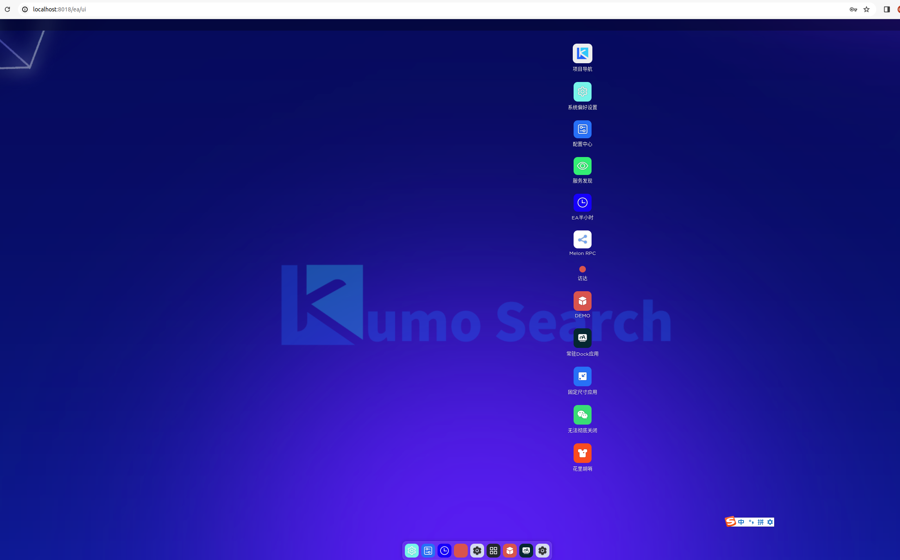
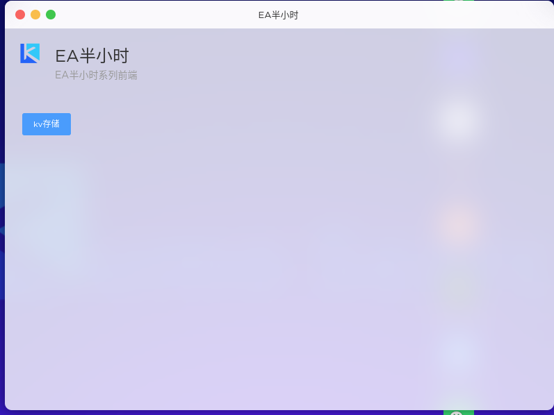
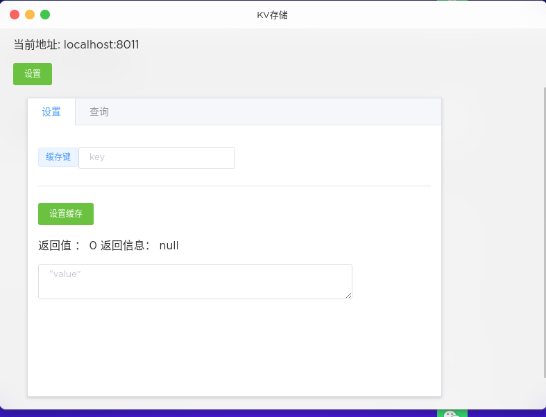
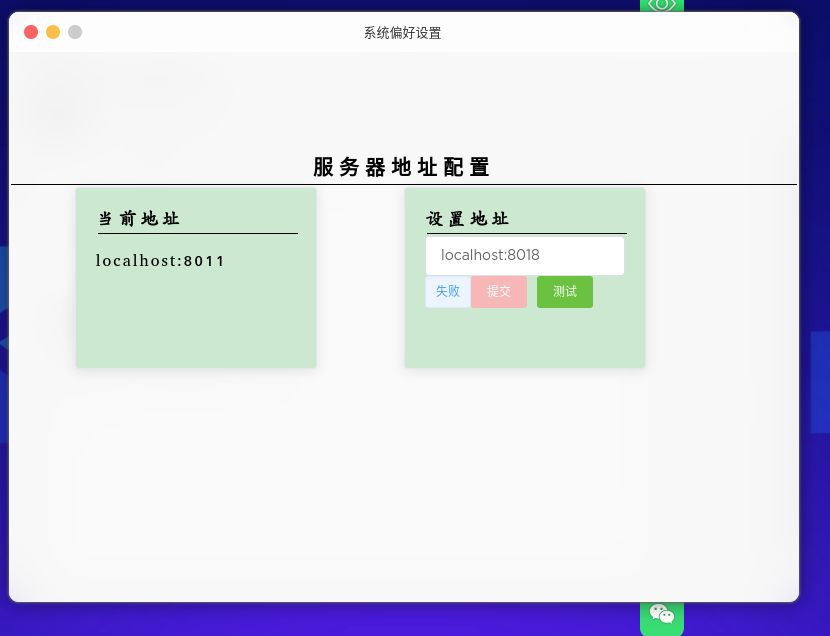
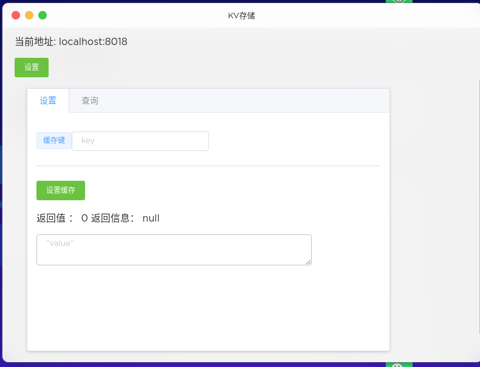
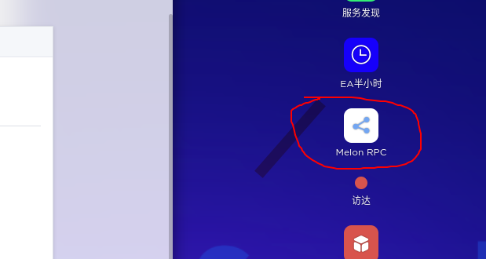
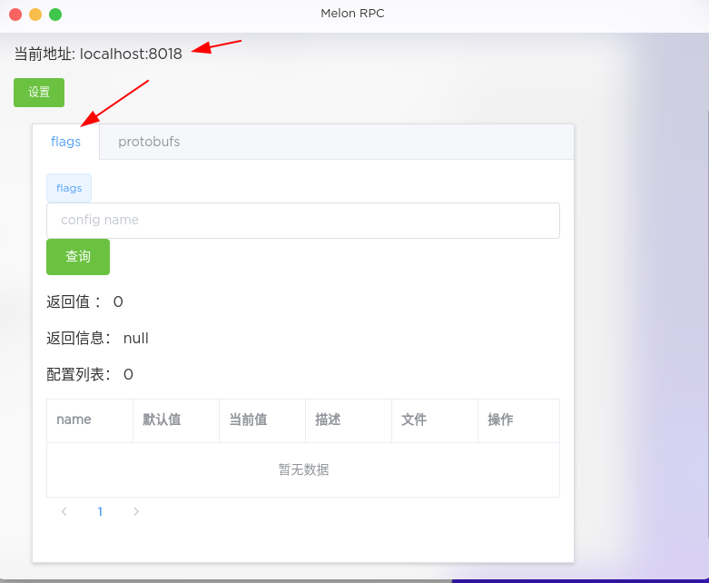
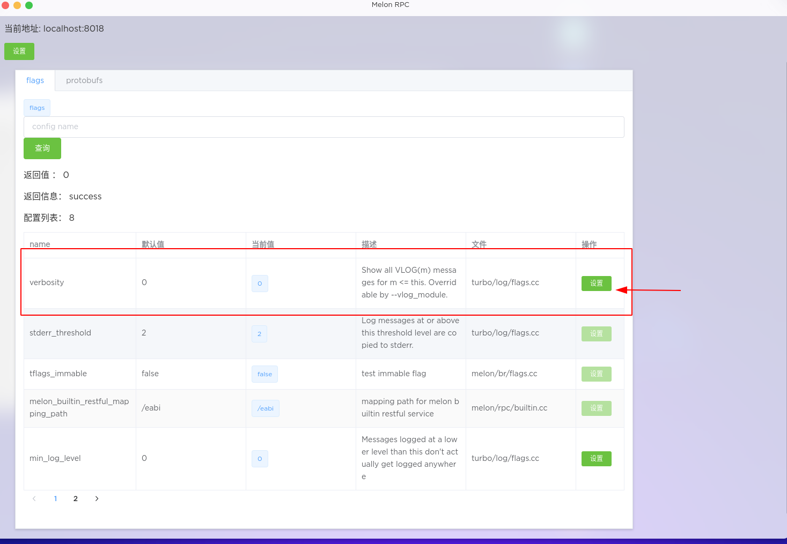
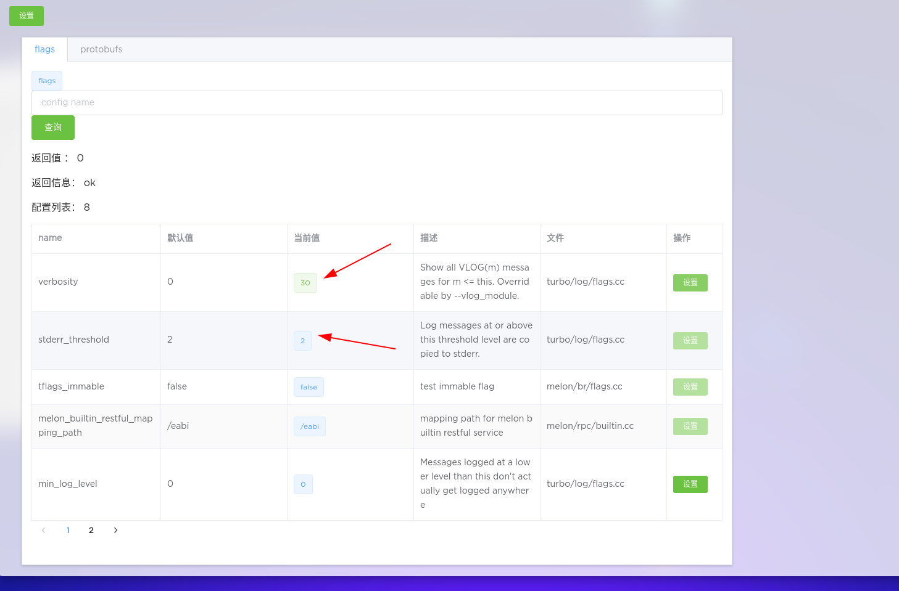

a009 hala dkv
============================

本节要点:

* 部署`EAUI`为项目提供`UI`服务
* 启动内置`web server`提供`UI`服务
* 使用 EA restful api 提供 restful 服务
* 使用 EA UI 管理 配置，控制日志输出级别。

本节代码位于：[a010-hala-dkv](https://github.com/gottingen/ea-half-an-hour/tree/master/a010-hala-kv)

# 编译项目

```shell
$ cd a010-hala-kv
$ carbin install
$ mkdir build
$ cd build
$ cmake ..
$ make
```

# 下载部署`EAUI`

```shell
$ wget https://github.com/gottingen/neptune/releases/download/v0.2.0/dist.tar.gz
$ tar -zxvf dist.tar.gz
$ mv dist www
```
# 启动服务

打开三个终端，分别启动三个服务。
在build目录下执行以下命令：
```shell
$ ./halakv/kv_server --local_peer=127.0.0.1:8018
```
```shell
$ ./halakv/kv_server --local_peer=127.0.0.1:8019
```
```shell
$ ./halakv/kv_server --local_peer=127.0.0.1:8020
```

# 访问前端

打开浏览器，访问 `http://localhost:8018/ea/ui`, 或者 `http://localhost:8019/ea/ui`, 
或者 `http://localhost:8020/ea/ui` ，可以看到前端页面。进入界面。

初次打开，会提示输入用户名和密码，用户名和密码都是`admin`(实际上任何用户名和密码都可以)。



## 使用前端操作kv

双击`EA半小时`，进入`EA半小时`的配置界面。



点击`键值`，进入`键值`操作界面。



图中可以看到，当前地址是 `localhost:8011`, 这是个默认的地址，并不是我们的kv服务地址。需要将地址设置为上面启动的三个服务的地址中的任意
一个。

点击设置



将地址设置为 `localhost:8018`， 点击测试，测试是否可以连接。测试成功后，提交按钮变为可用状态，点击提交。这个地址的设置是全局的设置，在不刷新
页面的情况下，可以在任何地方使用这个地址。



接下来就可以在这个页面上操作kv了。输入key和value，点击`设置缓存`，可以设置kv。多尝试几次，可以看到kv被设置到了不同的节点上。
在查询界面，输入key，点击`查询缓存`，可以查询到对应的value。

## 使用前端操作日志

界面可以用鼠标拖动，找到桌面的`melon rpc`，双击进入。



进入后，可以看点界面，在 `flags`标签下，点击查询


点击后，可以看到flags 配置列表



verbosity 是控制VLOG输出的级别，初始值是0，目前不输出VLOG信息，我们在程序里定义的输出VLOG的级别是20，所以设置verbosity为30，VLOG信息就会输出。
注意哈，我们修改的是当前对应的服务的配置，不是全局配置，其他两个节点如果要输出VLOG信息，也需要设置verbosity。
修改后成功后，显示的颜色会有变化。



再回到刚才的`键值`界面，进行操作，查看设置节点的日志输出。

# 源码解析

前面演示了在前端界面上操作kv和日志输出，在服务过程中，是通过程序在后台运行操作kv的服务，可以参见client部分的源码，这里主要讲解服务端的源码。

## web server

web server是一个内置的框架内置的一个web server，提供了一个web ui的服务，实际是一个文件服务器，提供静态文件的服务。启动web server，
需要提供两个必须的参数

* 网络服务的映射地址
* 静态文件的根目录

我们从代码中看，启动的代码位于server.cc中，代码如下：

```c++
    melon::WebuiConfig conf = melon::WebuiConfig::default_config();
    conf.mapping_path = "/ea/ui";
    conf.root_path = FLAGS_root_path; // 'www'
    auto instance = melon::WebuiService::instance();
    rs = instance->register_server(conf, &server);
    if(!rs.ok()) {
        LOG(ERROR) << "register webui failed: " << rs;
        return -1;
    }
```
前面访问的地址是`http://localhost:8018/ea/ui` ， `mapping_path`是`/ea/ui`， `root_path`是`www`，
所以访问的地址是`http://localhost:8018/ea/ui` 。 前端浏览器会请求`http://localhost:8018/ea/ui/index.html`，这个文件在
对应的是`www/index.html`。其他的文件也是类似的。作为web server， 需要对访问的文件的content-type进行设置，感兴趣的读者看melon/rpc/webui.*
文件。

## kv proxy

kv proxy是kv服务的代理层，全面同服务端的kv服务进行交互的汇总点。kv proxy根据请求key的hash值，将请求转发到对应的kv服务节点上。
如果是本地的kv服务，直接调用本地存储实例，如果不是本地的kv服务，调用网络请求发送到对应的kv服务节点上。

kv proxy 上层有两个应用调用它，一个是restful服务，一个是二进制的协议服务。这两个服务都是通过kv proxy来操作kv的。
这样封装的好处是，上层的服务不用去关心kv服务的具体实现，只要把精力放在与自己的业务逻辑上。细心的读者会发现，`EA` 体系的设计理念。

## restful 服务

webui上展示的效果，是通过restful服务来操作kv的。restful服务是一个http服务，提供了一些http接口，通过http请求来操作kv。
与0.5.x的melon不同，0.6.x的melon提供了一个内置的restful服务，简而言之，只需要提供对应路径的处理函数，就可以实现一个restful服务。
在上个版本的实现中，用户还需要自己去处理路径的转发等操作，经过melon的升级，这些操作都被内置到melon中，用户只需要关心自己的业务逻辑。
如kv 的set操作，代码如下：

声明：
```c++
struct CacheSetProcessor : public melon::RestfulProcessor {
        void process(const melon::RestfulRequest *request, melon::RestfulResponse *response) override;
    };

```

实现：
```c++
     void CacheSetProcessor::process(const melon::RestfulRequest *request, melon::RestfulResponse *response) {
        response->set_content_json();
        response->set_access_control_all_allow();
        auto &uri = request->uri();
        auto *key = uri.GetQuery("key");
        auto &value = request->body();
        if (key == nullptr || value.empty()) {
            response->set_status_code(200);
            response->set_body(get_nokey_err());
            return;
        }
        halakv::KvResponse kv_response;
        halakv::KvRequest kv_request;
        kv_request.set_key(*key);
        kv_request.set_value(value.to_string());
        auto rs = KvProxy::instance()->set(&kv_request, &kv_response);
        if (!rs.ok()) {
            response->set_status_code(500);
        } else {
            response->set_status_code(200);
        }
        std::string json;
        if (json2pb::ProtoMessageToJson(kv_response, &json)) {
            response->set_body(json);
        } else {
            response->set_body(get_proto_conversion_err());
        }
    }
```

注册：
```c++
     service->set_processor("/cache/set", std::make_shared<CacheSetProcessor>());
```

这段代码，在请求路径为`/ea/cache/set`时，`ea`是restful服务的根路径，用户可以自己定义，处理函数处理对应为`ea`之后的路径。
这里可以看到，set函数的三部曲，检查参数， 调用kv proxy获取，检查并返回结果。

二进制服务，逻辑相同，区别在于处理protobuf和json的区别。

# 总结

本节主要讲解了如何使用`EAUI`来管理`KV`服务，通过`EAUI`可以方便的管理`KV`服务，设置`KV`服务的地址，设置`VLOG`输出级别等。
`EA`提供了内置的`web server`和`restful`服务，用户可以方便的使用这些服务来实现自己的业务逻辑。`EA`的设计理念是，提供一个
统一的服务框架，用户只需要关心自己的业务逻辑，不需要关心服务的具体实现。

# 思考

我们已经是现在可以在生产环境中的使用的一些应用，比如kv server，改动一下参数，就可以用在生产环境使用。当然还有一些实际的问题，在生产环境中
还有更便利的方式来管理服务。如：

* 批量更新服务的配置
* 上游服务自动发现等等

看过界面的同学，如果比较细心，应该已经发现界面上有一些功能我们这里没有讲到，比如服务发现，配置中心等应用，后续，我们将带着这些问题，继续的完善
分布式kv服务，介绍如何使用`EA`来实现这些功能和背后方案设计。