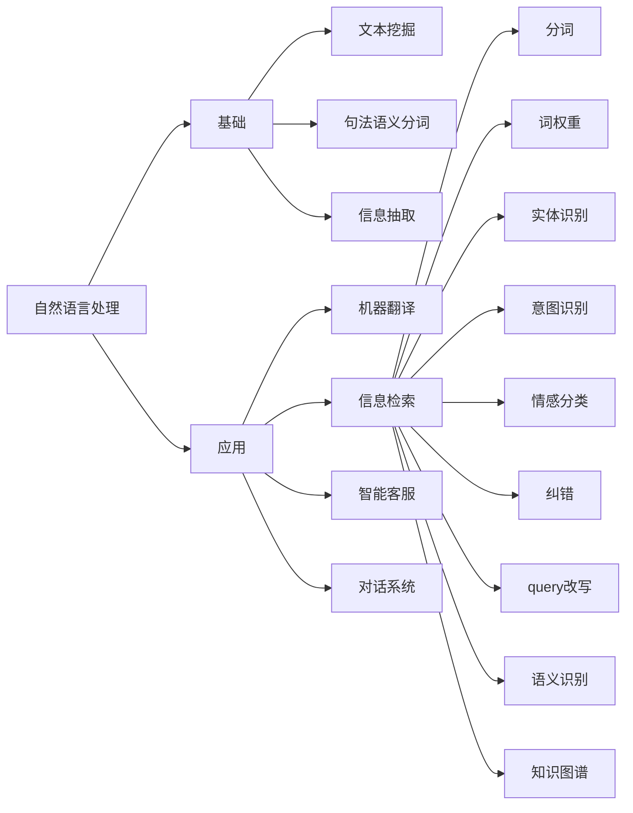

query understander
===

query understander we would call it as QU.
QU is a part of nlp, this part focus on nlp in searching  apps.

Natural language processing is a big topic, and here we focus 
on tasks related to the search part, so QU refers to this part 
of information inspection.

