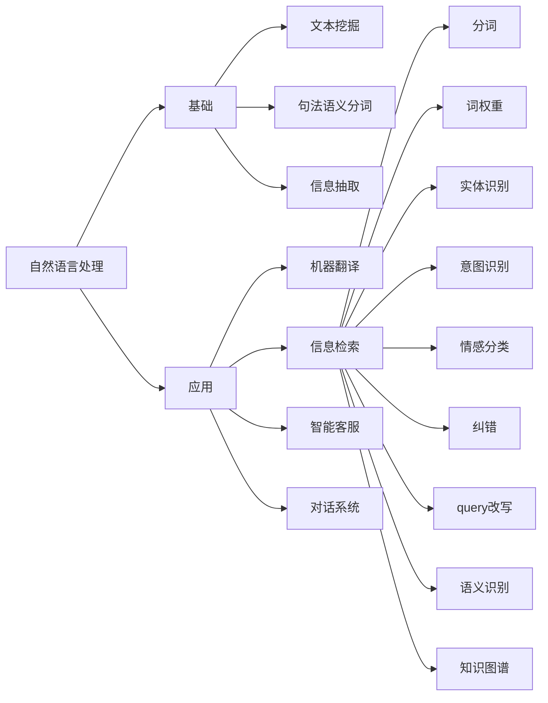

nlp
===
# what is nlp

Natural language processing is an important direction in the 
field of computer science and artificial intelligence. With the
development of LLM, the application has been further expanded.
He studies the theory and method of communication between real 
people and computers. Natural language processing is a 
convergent discipline. fusion of language, computer Mathematics 
and many other subjects.

query understander we would call it as QU.
QU is a part of nlp, this part focus on nlp in searching  apps.

Natural language processing is a big topic, and here we focus 
on tasks related to the search part, so QU refers to this part 
of information inspection.

# Syntactic Semantic Analysis
For a given sentence, perform word segmentation,
part-of-speech tagging, named entity recognition, 
syntactic analysis, semantic role recognition, and 
polysemy disambiguation.

# information extraction
Extract important information from a given text, such as time, 
place, event, person, reason, result, number, date , currencies,
proper nouns, etc. Speaking human words is to extract when, where, to whom, what things
were done, How is the result. Design to named entity recognition,
causality extraction and other technologies.

# text mining
Including text clustering, classification, information extraction, 
summarization, sentiment analysis, and the expression interface 
(feature engineering) of the mined information and knowledge, and 
the way of interactive expression, mainly based on statistical 
machine learning

* [segment](seg/README.md)

[back](../README.md)