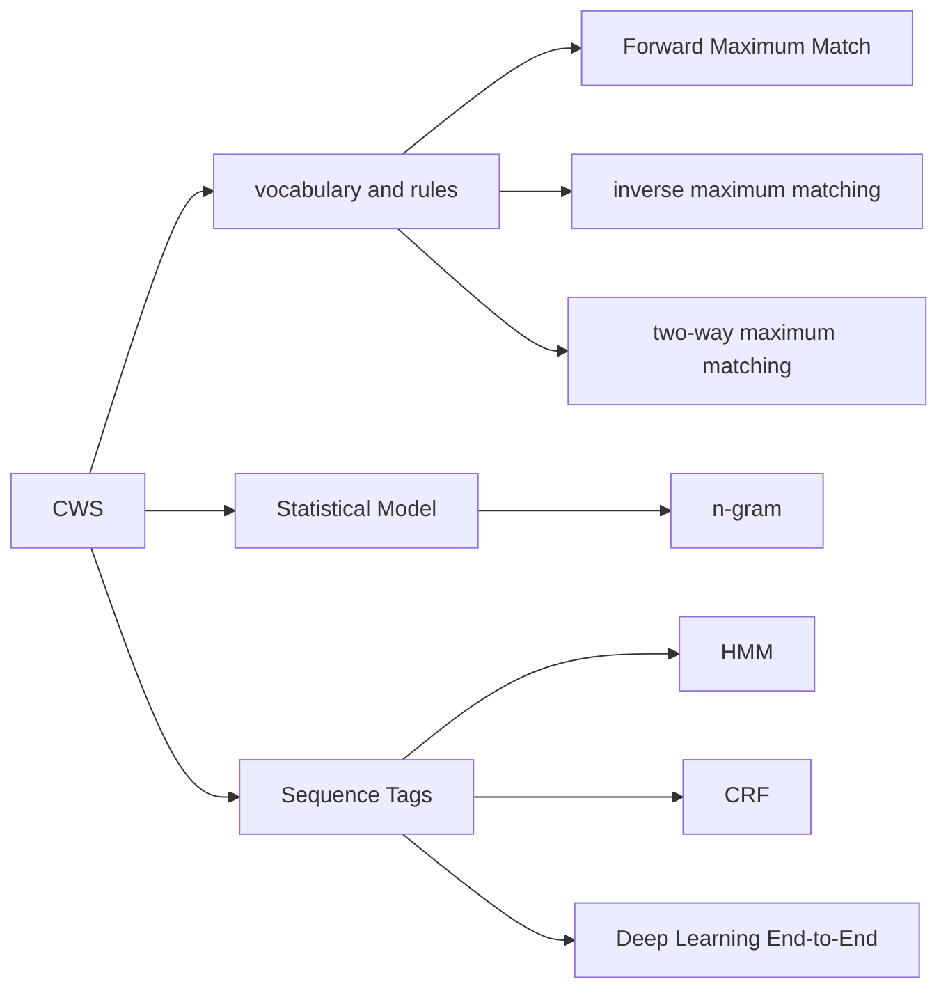

Chinese Word Segmentation -- CWS
===

# what is `cws`
`cws` It refers to dividing a sequence of Chinese characters 
into a sequence of words, which is converted from one sequence 
to another.

# CWS algorithm

# tools

## [libtext](https://github.com/gottingen/libtext)

this repo using jieba c++ as a baseline.