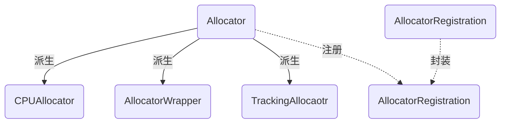

allocator
===

# allocator

Allocator是所有内存分配器的基类，它定义了内存分配器需要实现的接口。

```c++
class Allocator {
public:
    //内存分配与返还
    virtual void* AllocateRaw(size_t alignment, size_t num_bytes) = 0;
    virtual void DeallocateRaw(void* ptr) = 0;
    T* Allocate(size_t num_elements);
    T* Allocate(size_t num_elements, const AllocationAttributes& allocation_attr);
    void Deallocate(T* ptr, size_t num_elements);
    
    //追踪内存分配信息
    virtual bool TracksAllocationSizes();
    virtual bool ShouldAllocateEmptyTensors();
    virtual size_t RequestedSize(void* ptr);
    virtual size_t AllocatedSize(void* ptr);
    virtual int64 AllocationId(void* ptr);//本次内存分配的编号
    virtual size_t AllocatedSizeSlow(void* ptr);
    virtual void GetStats(AllocatorStats* stats);
};
```
这些API可以被分为两类，一是内存分配与返还，二是内存分配信息追踪。前者是内存分配器的本职工作，后者提供了对内存分配器所分配的内存进行追踪和管理的功能。若想实现后者的功能，需要提供一定的数据结构支持，下文中的“内存分配追踪”会详细讲到。

另外还遇到了一个新的结构AllocatorStats，这个类是对内存分配器当前分配内存量的一个宏观统计，它的定义如下：

```c++
struct AllocatorStats {
    int64 num_allocs;//内存分配次数
    int64 bytes_in_use;//分配的内存中，当前正在使用的大小
    int64 max_bytes_in_use;//使用中的内存大小的峰值
    int64 max_alloc_size;//最大的单次内存分配大小
    int64 bytes_limit;//当前内存分配器能分配的最大内存量，如果申请内存大小超过这个阈值，返回0
    //...
}
```
Allocator除了提供内存申请的接口之外，还提供了为申请好的内存调用默认构造和析构函数的接口。如果在申请的时候指定了对象的类型，就可以选择调用对象所属类的构造和析构方法。Allocator提供了针对三种常用类的构造方法，分别是String，ResourceHandle和Variant。

```c++
class Allocator {
public:
    //...
private:
    void RunCtor(T* p, size_t n);
    virtual void RunStringCtor(string* p, size_t n);
    virtual void RunStringDtor(string* p, size_t n);
    virtual void RunResourceCtor(ResourceHandle* p, size_t n);
    virtual void RunResourceDtor(ResourceHandle* p, size_t n);
    virtual void RunVariantCtor(Variant* p, size_t n);
    virtual void RunVariantDtor(Variant* p, size_t n);
};
```
除了抽象的内存分配器接口之外，TF还为最常用的CPU内存分配器，提供了一个默认实现：

```c++
class CPUAllocator : public Allocator {
  public:
    //...
    void GetStats(AllocatorStats* stats) override {
        mutex_lock l(mu_);
        *stats = stats_;
    }
    size_t AllocatedSizeSlow(void *ptr) override {
        return port::MallocExtension_GetAllocatedSize(ptr);
    }
  private:
    mutex mu_;
    AllocatorStats stats_ GUARDED_BY(mu_);
};
```
需要注意两点，第一，它为内存分配宏观统计加入了一个数据成员stats_，在需要时直接将其返回，第二，为追踪内存分配大小提供了一个“慢”版本的实现，这个实现的意义在于，如果需要知道某个指针对应的分配内存的大小，而我们又没有专门为其准备这样的数据记录时，可以直接调用操作系统层面的函数，来获取指针对应的分配内存的大小。这个操作会相对耗时，但聊胜于无。

# 内存分配器的管理

不同类型的设备，需要不同的内存分配器，即便对于相同类型的设备，考虑到效率问题，也可能会提供不同的内存分配器版本。因此，需要一个对内存分配器进行集中管理的地方，TF为我们提供了类AllocatorRegistry：
```c++
class AllocatorRegistry {
  public:
    //内存分配器注册
    void Register(const string& name, int priority, Allocator* allocator);
    //返回最高优先级的内存分配器
    Allocator* GetAllocator();
    //返回一个全局的内存分配器的注册器
    static AllocatorRegistry* Global();
  private:
    //内存分配器存储位置
    std::vector<AllocatorRegistryEntry> allocators_;
    //...
}
```
所有的内存分配器都被保存在allocators_这个向量里，但向量中保存的并不是内存分配器本身，而是对它的一个封装，我们看下这个封装的结构：
```c++
typedef struct {
    string name;
    int priority;
    Allocator* allocator;
} AllocatorRegistryEntry;
```
除了内存分配器之外，这个entry里还存放了内存分配器的名称和优先级。当向AllocatorRegistry请求一个内存分配器时，它返回的是具有最高优先级的分配器，如果多个分配器有相同的优先级，就返回其中的一个。

AllocatorRegistry实际上是一个单例对象，它的Global接口返回一个全局静态的注册器对象。为了方便进行注册，TF还设计了一个统一的注册入口类：
```c++
class AllocatorRegistration {
  public:
    AllocatorRegistration(const string& name, int priority, Allocator* allocator){
        AllocatorRegistry::Global()->Register(name,priority,allocator);
    }
};
```
另外，TF还设计了一个宏来简化注册过程，感兴趣的读者可以参考源代码。

# 内存分配追踪
刚才提到，在内存分配器的公共API中，有一类专门用于追踪内存分配，需要有一些专用的数据结构，来保存每一次内存分配的信息。这些工作被TrackingAllocator类实现：
```c++
class TrackingAllocator : public Allocator {
  public:
    std::tuple<size_t, size_t, size_t> GetSizeAndUnRef();
    //...
  private:
    bool UnRef() EXCLUSIZE_LOCKS_REQUIRED(mu_);
    Allocator* allocator_;
    mutex mu_;
    int ref_ GUARDED_BY(mu_);
    //当前仍在使用的分配内存大小，如果allocator_不支持内存追踪，则为0
    size_t allocated_ GUARDED_BY(mu_);
    //allocated_的峰值
    size_t high_watermark_ GUARDED_BY(mu_);
    //当前内存分配器总共分配的内存大小
    size_t total_bytes_ GUARDED_BY(mu_);
    
    const bool track_sizes_locally_;
    struct Chunk {
        size_t requested_size;
        size_t allocated_size;
        int64 allocation_id;
    };
    std::unordered_map<void*, Chunk> in_use_ GUARDED_BY(mu_);
};
```
除了提供allocated_，high_watermark_，total_bytes_三个数据成员记录内存分配的统计信息之外，更重要的是加入了in_use_这个数据成员。它从一个指针映射到一个Chunk，而这个Chunk中保存了每次内存分配需要的内存大小、实际分配的内存大小、本次内存分配的唯一标识。用这样一个结构保存了每次内存分配的详细信息。

再细说一下ref_成员的作用。这个数据成员存在的意义在于，保存当前内存分配器分配内存的次数，当所有分配的内存全部回收之后，就删除掉当前的内存分配器。但你会发现，这个ref_成员在TrackingAllocator对象初始化的时候，本身已经赋值为1了，那即便我们每次返回内存时都调用UnRef函数将它减一，最终不还是不能为0吗？原因在于，我们希望对于GetSizeAndUnRef这个函数在对象的生命周期内只调用一次，因此这个函数调用后会将ref_减一。而不论是GetSizeAndUnRef函数还是调用UnRef，只要ref_值减到0，就删除这个对象。这要求我们必须仅调用GetSizeAndUnRef函数一次，否则就会出现内存泄漏。

# 其它结构

在TF中，计算是发生在节点上的，而节点被分配在具体的设备上。对于一个GPU设备，在它上面运行的节点，是不是就不需要CPU内存了呢？显然不是，比如，为了使用DMA给某些设备传送数据，运行在GPU上的节点仍然需要申请CPU内存。因此，当节点向一个设备索要内存分配器时，需要给它提供一些信息，告诉设备我们想要申请哪种类型的内存，这些信息就存储在AllocatorAttributes类中。

```c++
struct AllocatorAttributes {
    void set_on_host(bool v);
    bool on_host() const;
    void set_nic_compatible(bool v);
    bool nic_compatible() const;
    void set_gpu_compatible(bool v);
    bool gpu_compatible() const;
    void set_track_sizes(bool v);
    bool track_sizes() const;
    void Merge(AllocatorAttributes other);
    bool IsEqualOrLessRestrictiveThan(const AllocatorAttributes& other);
    uint32 value = 0;//这个数值的高8位被保留为设备相关的设置。各设备的实现可以根据需要自行解析，为这些设备实现的操作也需要正确的解析它
}
```
AllocatorAttributes很容易与另外一个类混淆，那就是AllocationAttributes。后者记录的是为内存分配器的某一次具体的内存分配的属性信息，使用时机完全不一样。

```c++
class AllocationAttributes {
    bool no_retry_on_failure = false; //如果首次内存分配失败了，不再尝试。
    bool allocation_will_be_logged = false;//本次内存分配是否会被记录
}
```
另外，有时候我们想对某个内存分配器进行封装，以便在某个API上实现定制化。TF为此准备了类AllocatorWrapper类，它本质上就是对Allocator类的直接封装，感兴趣的读者可以去看下源码。

# 类图


# 文件

* [allocator.h](../tensorflow/core/framework/allocator.h)
* [allocator_registry.h](../tensorflow/core/framework/allocator_registry.h)
* [tracking_allocator.h](../tensorflow/core/framework/tracking_allocator.h)