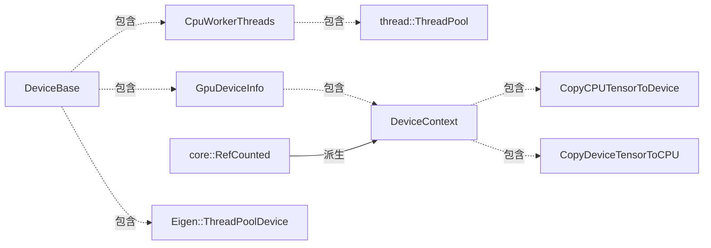

framework device
==

# device
“device”是一个很容易引起混淆的概念，在TF中，设备device专指能够执行实际计算的计算设备，比如CPU，GPU，SYNC设备等等。因此，一定要跟机器的概念区分开，一台机器可以包含多个设备。

# DeviceAttributes
对设备有了一个清晰的概念之后，我们看下TF为了描述设备属性准备的proto，DeviceAttributes：
```c++
message DeviceAttributes {
    string name = 1;
    string device_type = 2;//设备类型
    int64 memory_limit = 4;//内存大小
    DeviceLocality locality = 5;//平台相关的，为支持数据有效传输而准备的数据
    fixed64 incarnation = 6;//每个设备在初始化后会被赋予一个全局唯一的编号，这个编号必须不能为0
    string physical_device_desc = 7;//该设备所对应的物理设备的字符串描述
};
```
关于其中locality字段的详细含义，笔者还没找到具体的应用，有知道的读者还请告知。

# device_base
DeviceAttributes只是对设备属性的一些简单描述，真正的设备基类是DeviceBase，我们来看一下它的结构：
```c++
class DeviceBase {
  public:
    explicit DeviceBase(Env* env) : env_(env){}
    //...
  private:
    Env* const env_;
    CpuWorkerThreads* cpu_worker_threads_ = nullptr;
    GpuDeviceInfo* gpu_device_info_ = nullptr;
    Eigen::ThreadPoolDevice* eigen_cpu_device_ = nullptr;
};
```
我们看到，DeviceBase构造函数的参数是Env指针，这里的Env在lib文件夹中定义，是对操作系统相关功能的统一封装，包括了文件系统等功能，使framework的实现尽量对操作系统层透明。
另外，DeviceBase的私有成员中，还出现了两个没见过的类，分别是CpuWorkerThreads和GpuDeviceInfo，我们分别看下它们的定义：
```c++
struct CpuWorkerThreads {
    int num_threads = 0;
    thread::ThreadPool* workers = nullptr;
}
struct GpuDeviceInfo {
    perftools::gputools::Stream* stream = nullptr;
    DeviceContext* default_context = nullptr;
    EventMgr* event_mgr = nullptr;
    int gpu_id = -1;
};
```
前者是一个对线程池的简单封装，后者用于描述GPU相关的信息，其中的stream是流执行器，我们在后面会详细介绍。EventMgr是一个事件管理器，用于响应特殊的事件。那么DeviceContext是什么呢？
```c++
class DeviceContext : public core::RefCounted {
  public:
    //...
    virtual void CopyCPUTensorToDevice(const Tensor* cpu_tensor, Device* device, Tensor* device_tensor, StatusCallback done) const;
    virtual void CopyDeviceTensorToCPU(const Tensor* device_tensor, StringPiece tensor_name, Device* device, Tensor* cpu_tensor, StatusCallback done);
};
```
它是一个基于引用计数的类，主要的API包含CPU和设备之间的张量拷贝。也就是说，任何一个GPU设备都包含了CPU张量与设备张量之间相互拷贝的API接口。

到这里我们总结一下，DeviceBase针对CPU设备，包含了一个CPU的线程池，和一个eigen_cpu_device，而对于GPU设备，包含了一个GpuDeviceInfo，这个结构中除了包含GPU执行器、事件响应器之外，还包含了一个DeviceContext，这个结构中包含了CPU和GPU之间相互拷贝张量的API。

# 类图



# 文件

* [device_attributes.proto](../tensorflow/core/framework/device_attributes.proto)
* [device_base.h](../tensorflow/core/framework/device_base.h)
* [device.h](../tensorflow/core/framework/device.h)
* [device_factory.h](../tensorflow/core/framework/device_factory.h)