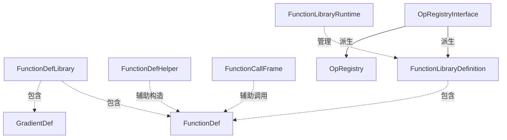

framework function
===

# function

在讲解function的概念之前，我们要先回顾下op。op是规定了输入和输出的操作声明，在研究node的时候我们也看到，NodeDef是包含OpDef的，那么是不是op就只能是节点级别的操作呢？并非如此，操作是可以嵌套的，也就是说，操作A可能内部包含了操作B、C、D。从这个角度理解function就容易了，function其实就是一些大的op。函数的本质是给定输入，经过计算给出输出，这与op的定位相同。对于一些大op，我们可以定义函数与之对应，这些函数内部会包含OpDef，表示这个函数的签名（输入、输出），也会包含一系列NodeDef，用于表示函数内部的运行机制。

# FunctionDef

下面是FunctionDef的结构：
```protobuf
message FunctionDef {
    OpDef signature = 1;
    map<string, AttrValue> attr = 5;//函数中的内部参数
    repeated NodeDef node_def = 3;
    map<string, string> ret = 4;//一个从signature中输出参数名称，到node_def的输出的映射
}
message GradientDef {
    string function_name = 1;//原函数名称
    string gradient_func = 2;//梯度函数名称
}
message FunctionDefLibrary {
    repeated FunctionDef function = 1;
    repeated GradientDef gradient = 2;
}
```
有以下几点需要说明：

* 正如我们刚才所说的，node_def是一系列节点，这些节点组合在一起形成了函数内部的结构。OpDef中包含了输入输出的名称，在function中我们的输出是被包含在node_def中的，所以需要一个从OpDef中的输出名称到输出所在节点名称和端口号的映射，于是就有了ret；
* TF支持梯度计算，是因为TF针对每个函数给出了它的梯度函数。梯度函数本身也是一个函数，有输入有输出，为了能将原函数和其梯度函数联系在一起，就有了GradientDef这个结构，这个结构中包含了原函数的名称，也包含了原函数所对应的梯度函数的名称；
* TF的运行时包含了一个函数定义库，需要使用某个函数时，可以去库里找，因此这个函数定义库包含了多个普通函数，和梯度函数；

# function related class

## FunctionDefHelper
为了方便对FunctionDef的定义，设计了FunctionDefHelper类，利用它可以方便的定义函数，如下：
```c++
FunctionDef my_func = FunctionDefHelper::Create(
  "my_func_name",
  {"x:T", "y:T"},//每个输入参数用一个字符串表示
  {"z:T"},//每个输出用一个字符串表示
  {"T: {float, double}"},//每个参数一条字符串
  {
      {{"o"},"Mul",{"x","y"},{{"T","$T"}}}
  },//每个元素对应一个节点，这里仅包含了一个节点
  {{"z", "o:z"}}//函数输出到节点输出的映射
);
```
# FuncionCallFrame
在TF图中，如果要调用一个function，仅知道函数定义是不够的，我们还要为向函数中传递数据，以及从函数中返回数据，提供结构和功能上的支持。还记得OpKernel类的Compute函数吗？每个kernel的计算函数都使用了同样一个接口，实现了不同的运算，秘密就在于函数的输入参数OpKernelContext，它相当于Compute函数调用的上下文，让同样的接口，可以为完全不同的运算提供支持。这也就是FunctionCallFrame存在的意义，它本质上是一个数据中转站，把函数输入数据填入这个结构，在函数计算结束后再把输出数据填入，让函数调用者获取需要的数据。从某种意义上讲，它很像函数调用所在的栈帧，这也就是FunctionCallFrame这个名字的由来：

```c++
class FunctionCallFrame {
    //...
  private:
    DataTypeVector arg_types_;
    DataTypeVector ret_types_;
    gtl::InlinedVector<Tensor, 4> args_;
    struct Retval {
        bool has_val = false;
        Tensor val;
    };
    gtl::InlinedVector<Retval, 4> rets_;
}
```
可以看出，这个类的私有数据成员只有输入输出类型、输入输出数值这样四类，本质上就是函数调用的一个中转站

## FunctionLibraryDefinition

刚才我们在看函数相关proto的时候看到一个结构，FunctionDefLibrary，这两个类要区分清楚。Definition类本质上是一个注册器，提供了函数注册、查找等功能，而Library本质上是一个函数定义的集合，不具备查找功能。下面我们来看一下，类的结构：
```c++
class FunctionLibraryDefinition : public OpRegistryInterface {
  private:
    struct FunctionDefAndOpRegistration {
        FunctionDefAndOpRegistration(const FunctionDef& fdef_in);
        FunctionDef fdef;
        OpRegistrationData op_registration_data;
    };
    const OpRegistryInterface* const default_registry_;
    gtl::FlatMap<string, std::unique_ptr<FunctionDefAndOpRegistration>> function_defs_;
    gtl::FlatMap<string, string> func_grad_;
};
```
这个类给我们提供了一个方便对function进行集中管理的地方。它继承自OpRegistryInterface，因此跟OpRegistry有相似之处。

## FunctionLibraryRuntime

顾名思义，是函数库的运行时类。为函数的执行提供了很多便利的接口。它单纯是包裹在FunctionLibraryDefinition这个类之上的，提供API支持，本身是没有任何数据成员的。我们简单看下它都提供了哪些API：

```c++
class FunctionLibraryRuntime {
  public:
    //...
    virtual Status Instantiate(const string& function_name, AttrSlice attrs, Handle* handle) = 0;//用参数实例化一个函数
    virtual const FunctionBody* GetFunctionBody(Handle h) = 0;//获取一个已经实例化了的函数的函数体
    virtual void Run(const Option& opts, Handle handle, gtl::ArraySlice<Tensor> args, std::vector<Tensor>* rets, DoneCallback done) = 0;//异步的调用一个使用handle标识的函数
    virtual Status CreateKernel(const NodeDef& ndef, OpKernel** kernel) = 0;//给定ndef，创造一个kernel
    virtual bool IsStateful(const string& function_name) = 0;//该函数是否是带有状态的
    virtual Device* device() = 0;//函数运行所在的设备
    virtual const FunctionLibraryDefinition* GetFunctionLibraryDefinition() const = 0;
    virtual Env* env() = 0;
};
```

# 类图



# 文件

* [function.proto](../tensorflow/core/framework/function.proto)
* [function.h](../tensorflow/core/framework/function.h)
* [function_handle_cache.h](../tensorflow/core/framework/function_handle_cache.h)

