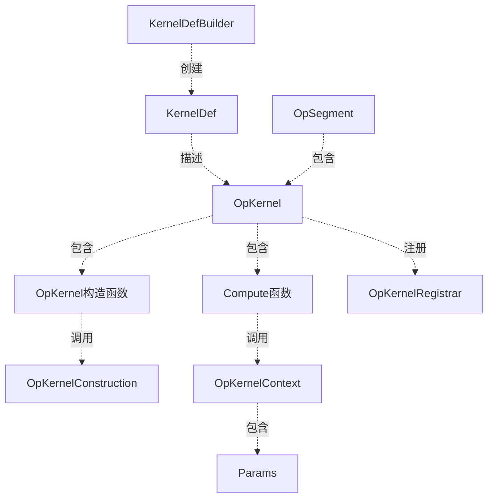

framework kernel
===

# kernel
如果说op相当于操作的声明，那么kernel就是操作的实现。同一份声明在不同的设备上，最优的实现方式是不一样的，比如对于MatMul矩阵相乘这个操作，在CPU上可以用SSE指令优化加速，在GPU上可以用GPU实现高性能计算。因此就会对应CPU和GPU两种不同的实现。所以，在定义一个kernel时，除了要指明kernel对应的op之外，还需要指明kernel所在的设备类型。

另外，kernel是一个运行期的概念。在定义图时，每个节点的op并不知道具体是由哪个kernel实现这个操作的，因为这时节点还没有被分配到具体的设备上，因此也就没法为其选择合适的kernel。

# kernel_def
虽然kernel是一个运行期的概念，但我们仍然需要用一些静态的信息对kernel进行描述，这个静态的信息就是KernelDef这个proto，定义如下：
```c++
message KernelDef {
    string op = 1;//对应操作的名称
    string device_type = 2;//对应设备的类型
    message AttrConstraint {
        string name = 1;
        AttrValue allowed_values = 2;
    }
    repeated AttrConstraint constraint = 3;//对应op中对参数的限制
    repeated string host_memory_arg = 4;//操作的输入或输出参数中，存在于host内存而不是device内存中的参数
    string label = 5;
}
```
其中的label字段我们解释一下。有时候用户会编写一些实验性的kernel，然后注册到某一个op上去。但这种kernel默认情况下是不会被使用的，除非用户用户在op中定义了一个_kernel字段，并且把这个字段赋值为某个kernel的label对应的值。举个例子，如果我们定义了一个MulKernel，且把它的label设置为'mulkernel'，假设这个kernel对应的操作叫做MulOp，那么只有MulOp也包含一个字段_kernel，并且_kernel="mulkernel"时，MulKernel才可以被MulOp使用。

按照惯例，TF也会为KernelDef设计一个构建类，这就是KernelDefBuilder。与之前的构建类类似，KernelDefBuilder也只是提供了一系列的属性设置API，私有数据成员也只有一个KernelDef指针：
```c++
class KernelDefBuilder {
    //...
  private:
    KernelDef* kernel_def_;
}
```
# op_kernel

如果说KernelDef只是对kernel的静态信息描述，那这里就要介绍kernel的本尊了，OpKernel是所有真正kernel的基类，它除了像KernelDef一样包含数值属性之外，还提供了kernel的核心API，compute函数。接下来我们仔细看一下OpKernel类的结构：
```c++
class OpKernel {
  public:
    explicit OpKernel(OpKernelConstruction* context);
    virtual void Compute(OpKernelContext* context) = 0;//执行同步计算
    virtual AsyncOpKernel* AsAsync() { return nullptr; }
  private:
    const std::unique_ptr<const NodeDef> def_;
    const DataTypeVector input_types_;//输入的数据类型
    const MemoryTypeVector input_memory_types_;//输入的内存类型
    const DataTypeVector output_types_;//输出的数据类型
    const MemoryTypeVector output_memory_types_;//输出的内存类型
    const bool is_internal_;//是否是内部操作
    NameRangeMap input_name_map_;
    NameRangeMap output_name_map_;
    bool expensive_;//是否是复杂操作
}
```

以下对这个类进行一些说明：
* 在构造函数中，我们发现它需要的是一个OpKernelConstruction指针，我们猜想，这个指针应该包含了构建一个OpKernel所必须的数据成员和功能函数，我们将在下文中详细介绍；
* 另外，在核心API Compute中，接收的是一个OpKernelContext指针的参数，我们猜想，这个指针应该包含了OpKernel执行实际计算所需要的数据成员和功能函数。下文中也会专门介绍这个类；
* 除此之外，我们还发现了一个指向NodeDef的指针。之前说过了，kernel是一个运行期的概念，虽然kernel是op的具体实现，但运行期中，op是跟具体的节点绑定在一起的，所以每个kernel都需要绑定一个具体的节点；
* kernel可以被分为同步kernel和异步kernel两类，大部分的kernel都应该是同步的，Compute函数在计算结束后返回结果状态，但有些操作本身就是异步的，因此需要将某些kernel设计为异步的，比如网络数据接收操作，如果这个操作被设计成同步，那么如果有其它线程在使用同一个网络接收服务，当前线程就会被阻塞，从而造成资源的浪费。

刚才讲到了异步kernel，现在我们就来看一下异步kernel对应的类，AsyncOpKernel：
```c++
class AsyncOpKernel : public OpKernel {
  public:
    typedef std::function<void()> DoneCallback;
    virtual void ComputeAsync(OpKernelContext* context, DoneCallback done) = 0;
    //...
};
```
可见，异步计算的API除了context之外，还需要提供一个回调函数，在异步计算执行结束之后调用。

# OpKernelConstruction
刚才我们提到，OpKernel的构造函数中，需要一个类型为OpKernelConstruction指针的参数，并且猜想这个参数包含了OpKernel构建所必须的数据成员和功能函数，实际上也确实如此，我们先来看下这个类的结构：

```c++
class OpKernelConstruction {
  public:
    Status allocate_temp(DataType type, const TensorShape& shape, Tensor* out_temp);//分配一块临时内存
    Status allocate_persistent(DataType type, const TensorShape& shape, PersistentTensor* out_persistent, Tensor** out_tensor);//分配一块可复用内存
    //...
  private:
    const DeviceType device_type;
    DeviceBase* const device_;
    Allocator* allocator_;
    const NodeDef* def_;
    const OpDef* op_def_;
    FunctionLibraryRuntime* flib_;
    DataTypeSlice input_types_;
    MemoryTypeSlice input_memory_types_;
    DataTypeSlice output_types_;
    MemoryTypeSlice output_memory_types_;
    const int graph_def_version_;
    Status* status_;
}
```

其中有几点需要说明：
* 关于临时内存和可复用内存。在OpKernel构建的过程中，我们可能需要分配一些内存，有些内存是临时性的，在OpKernel构建结束之后就没用了，我们会自主进行申请和释放。另外，我们也希望有些内存是可以在OpKernel的多次执行之间共享的，比如，有些kernel是有状态的，例如Variable，我们必须在kernel构建时就给这些内容申请内存；
* 关于可复用内存，还有一点需要说明。对于在GPU上申请的可复用内存，由于GPU不像CPU那样内存方便管理，因此运行时需要对每一份内存的使用情况了如指掌，因此对于可复用的内存，我们必须对其每一次使用都了解。TF为此专门设计了一个PersistentTensor类，这个类是对Tensor的封装，但对于内部张量数据只能通过一个AccessData的接口来访问，只要我们在这个接口里设置一个Watcher，就能监控所有可复用内存的使用了；
* 关于PersistentTensor还有一个疑点，我们知道OpKernelConstruction类能够在OpKernel初始化时申请永久内存，但在这两个类中，都没有发现对它的存储。既然永久内存时可以供kernel在不同启动之间共享的，那在第二次启动时怎样找到这个张量呢？还记得在resource章节中，我们介绍的resource_op_kernel吗？这个kernel实际上就是存储永久张量的地方。在申请了一个永久张量之后，我们为之申请一个新的resource_op_kernel来管理它，需要这个张量时，就向这个kernel索取。具体的做法是，可以为resource_op_kernel申请一个新的节点，并在新节点与原kernel所在节点之间连接一条边，使新节点作为老节点的输入；
* 私有数据中还有一个FunctionLibraryRuntime结构的指针，顾名思义，这个结构表示一个运行时的函数库，我们将在function章节中详细描述；

# OpKernelContext
还记得我们刚才提到，OpKernel的核心API Compute函数，需要一个类型为OpKernelContext指针的输入参数吗？刚才我们猜想，这个类包含了执行kernel计算所需要的数据成员和功能函数，实际上也确实如此。下面我们来看下这个类的构成：

```c++
class OpKernelContext {
  public:
    //构造函数
    explicit OpKernelContext(Params* params);
    
    //输入获取
    const Tensor& input(int index);//获取不可变的输入张量
    Status input(StringPiece name, const Tensor** tensor);//获取不可变的输入张量
    Status input_list(StringPiece name, OpInputList* list);//获取不可变的输入数据列表
    Status input_ref_mutex(StringPiece name, mutex** out_mutex);//获取可变的引用输入
    Tensor mutable_input(int index, bool lock_held);//获取可变的引用输入
    Status mutable_input_list(StringPiece name, OpMultableInputList* list);//获取可变的引用输入列表
    void replace_ref_input(int index, const Tensor& tensor, bool lock_held);//替换某个引用输入
    Status replace_ref_input(StringPiece name, const Tensor& tensor, bool lock_held);
    
    //输入向输出传递
    //把引用输入转换为引用输出
    void forward_ref_input_to_ref_output(int input_index, int output_index);
    //将输入转换为指定形状的输出
    bool forward_input_to_output_with_shape(int input_index, int output_index, const TensorShape& output_shape, Tensor** output);
    Status forward_input_to_output_with_shape(StringPiece input_name, StringPiece output_name, const TensorShape& output_shape, Tensor** output);//同上
    //如果指定输入1.不是引用输入，2.与给出的属性描述一致，3.底层的buffer的引用计数为1，那么就返回一个指向该输入的底层数据的指针
    std::unique_ptr<Tensor> forward_input(int input_index, DataType dtype, const TensorShape& shape, MemoryType memory_type, const AllocatorAttributes& attr);
    //尝试把指定输入传递到指定输出，如果没有任何一个输入可以被传递，那么就申请一个新的内存作为输出
    Status forward_input_or_allocate_output(gtl::ArraySlice<int> candidate_input_indices, int output_index, const TensorShape& output_shape, Tensor** output);
    //尝试把指定输入用作临时变量，如果没有输入可用，则使用allocate_temp申请一个临时buffer
    Status forward_input_or_allocate_temp(gtl::ArraySlice<int> candidate_input_indices, DataType type, const TensorShape& shape, const AllocatorAttributes& allocator_attr, Tensor* out_temp);
    
    //输出获取
    Status output_list(StringPiece name, OpOutputList* list);
    
    //内存分配
    Status allocate_output(int index, const TensorShape& shape, Tensor** tensor);
    Status allocate_output(int index, const TensorShape& shape, Tensor** tensor, AllocatorAttributes attr);
    Status allocate_temp(DataType type, const TensorShape& shape, Tensor* out_temp, AllocatorAttributes allocator_attr, const AllocationAttributes& allocation_attr);
    Status allocate_persistent(DataType type, const TensorShape& shape, PersistentTensor* out_persistent, Tensor** out_tensor, AllocatorAttributes attr);
    
    //设置输出
    Status set_output(StringPiece name, const Tensor& tensor);
    Status set_output_ref(StringPiece name, mutex* mu, Tensor* tensor_for_ref);
    Status mutable_output(StringPiece name, Tensor** tensor);
    
    //...
    
  private:
    Status status_;
    Params* params_;
    mutable mutex mu_;
    gtl::InlinedVector<WrappedAllocator, 4> wrapped_allocators_ GUARDED_BY(mu_);
    gtl::InlinedVector<TensorValue,4> outputs_;
    ManualConstructor<UniqueTensorReferences> referenced_tensors_ GUARDED_BY(mu_);
    bool is_output_dead_ = false;
    int64 host_temp_memory_size_;
    int64 device_temp_memory_size_;
    gtl::InlinedVector<int64, 2> host_persistent_alloc_ids_;
    gtl::InlinedVector<int64, 2> device_persistent_alloc_ids_;
    int64 host_persistent_memory_allocated_;
    int64 device_persistent_memory_allocated_;
}
```
为了看清楚结构，代码我做了删减，即便如此，代码量仍然很大。对外的API包括了，获取输入，输入传递到输出，输出设置，输出获取，内存分配，下面我们重点讲几个核心概念：

* 关于输入和输出的类型，相信看过代码已经有印像了，以输入为例（输出类似），被分为两类，正常输入和引用输入。正常输入是不可改变的，但引用输入是可以改变的。可以理解为，如果你想改变正常输入所在张量的内部数据，只能新建一个张量，将正常输入的数据拷贝过来，然后改变新张量里的数据，但对于引用输入，就可以直接对其修改，有时候还可以把修改后的引用输入直接当作输出。因此输入获取的API里，所有的API都有针对正常输入和引用输入两个版本。而在输入到输出传输的API里，也专门有一个引用输入到引用输出的传输；
* 关于内存分配。在kernel执行期间，有三种分配内存的方式，第一种是分配永久内存，也就是上文中提到的可复用内存，因为某些操作是有状态的，在同一个kernel的多次调用之间，我们可以保留一些共享数据。第二种是分配输出内存，一个kernel可能会输出数据，这个数据必须先申请内存。第三种是分配临时内存，kernel计算中可能会用到一些临时的内存，计算结束之后就不用了；
* 在某些情况下，一个张量即便不是被分配为输出，也可能会被当做输出使用。这个张量可能是一个输入，或者是存储在一个永久张量中，或者在究竟输出哪个张量还没被确定之前就被分配了。这种情况下，我们可以使用set_output或者set_output_ref函数来指定，这个张量被用作输出。我们可以使用任何之前分配的张量作为输出，即便这个张量是被当做临时张量分配的。使用那些不是被allocate_output函数分配的张量当做输出会有一定的性能损耗，因为allocate_output使用了存储在output_attr_array中的AllocatorAttributes属性来决定怎样分配内存，如果使用的张量与这个内存分配的要求不符，可能会引起额外的张量内存拷贝；
  
在OpKernelContext的私有数据成员中，还有一个Params参数我们没有解释，下面就来看下它的结构：
```c++
struct Params {
    int step_id = 0;//执行的步骤编号
    OpKernel* op_kernel = nullptr;
    DeviceBase* device = nullptr;//该kernel执行时所在的设备类型
    PerOpGpuDevice* eigen_gpu_device = nullptr;
    
    //追踪相关
    bool track_allocations = false;
    bool log_memory = false;
    bool record_tensor_accesses = false;
    
    const AllocatorAttributes* output_attr_array = nullptr;//输出的内存分配器属性
    ResourceMgr* resource_manager = nullptr;//当前的op_kernel可以访问的共享资源
    ScopedStepContainer* step_container = nullptr;//属于当前op_kernel的单步资源
    Rendezvous* rendezvous = nullptr;//通信机制
    TensorStore* tensor_store = nullptr;
    CancellationManager* cancellation_manager = nullptr;
    
    const gtl::InlindecVector<TensorValue,4>* inputs = nullptr;//当前op_kernel的输入
    bool is_input_dead = false;
    const gtl::InlinedVector<AllocatorAttributes, 4>* input_alloc_attrs = nullptr;
    
    //设备上下文
    const gtl::InlineVector<DeviceContext*,4>* input_device_contexts = nullptr;
    DeviceContext* op_device_context = nullptr;
    
    //对控制流相关操作的支持
    FrameAndIter frame_iter;
    
    //函数调用支持
    FunctionCallFrame* call_frame = nullptr;
    FunctionLibraryRuntime* function_library = nullptr;
    std::function<void(std::function<void()>)>* runner = nullptr;
    StepStatsCollector* stats_collector = nullptr;
};
```
虽然Params这个名字并不起眼，实际上内部别有乾坤。这里面包含了OpKernel计算所需要的资源，其中有很多属于运行时的资源，我们当前还没有介绍到，因此先略过不表，等这些内容都讲完之后，再回过头来看它吧。

# kernel的注册
面对众多的OpKernel，我们也需要一个集中管理的地方，于是像OpRegistry一样，TF也设计了一个OpKernelRegistrar，本质上还是一个映射，定义如下：
```c++
class OpKernelRegistrar {
  public:
    typedef OpKernel* (*Factory)(OpKernelConstruction*);
    OpKernelRegistrar(const KernelDef* kernel_def, StringPiece kernel_class_name, Factory factory){
        if(kernel_def != nullptr){
            InitInternal(kernel_def, kernel_class_name, factory);
        }
    }
  private:
    void InitInternal(const KernelDef* kernel_def, StringPiece kernel_class_name, Factory factory);
}
```

似乎没有找到存储数据的位置？实际上答案在这个InitInternal函数中，我们先讲结果，追根溯源，得到了这样的一个结构定义：
```c++
typedef std::unordered_multimap<string, KernelRegistration> KernelRegistry;
```
这个结构还需要两个函数才能发挥作用：
```c++
void* GlobalKernelRegistry() {
    static KernelRegistry* global_kernel_registry = new KernelRegistry;
    return global_kernel_registry;
}
static KernelRegistry* GlobalKernelRegistryTyped() {
    return reinterpret_cast<KernelRegistry*>(GlobalKernelRegistry());
}
```
过把GlobalKernelRegistryTyped函数定义为static，使得它返回的数据唯一，因此我们也就得到了一个全局的KernelRegistry作为OpKernel的注册中心。至于KernelRegistration的结构，比较简单，还是留给读者自己去探寻吧。

# op_segment
有时候我们会为每个会话（Session）准备专用的kernel，因此就需要一个结构来管理每个会话的OpKernel，于是有了OpSegment类，我们看下它的结构：

```c++
class OpSegment {
  public:
    void AddHold(const string& session_handle);
    void RemoveHold(const string& session_handle);
    typedef std::function<Status(OpKernel**)> CreateKernelFn;
    Status FindOrCreate(const string& session_handle, const string& node_name, OpKernel** kernel, CreateKernelFn create_fn);
  private:
    typedef std::unordered_map<string, OpKernel*> KernelMap;
    struct Item {
        int num_holds = 1;
        KernelMap name_kernel;
        ~Item();
    };
    typedef std::unordered_map<string, Item*> SessionMap;
    mutalbe mutex mu_;
    SessionMap session_ GUARDED_BY(mu_);
    //...
};
```
可见，这个OpSegment类，本质上是一个SessionMap，它其实是一个SessionHandle到Item结构体的映射，而后者又是op名称到OpKernel结构的映射。我们可以用下面的图来表示：


我们看到在Item结构中，有一个num_holds成员，它表示有多少hold指向了某个SessionHandle，hold的作用可以理解为引用计数，防止Session被删掉。向一个SessionHandle添加hold就是为了防止SessionHandle对应的OpKernel被删除。

# 类图



# 文件

* [op_kernel.h](../tensorflow/core/framework/op_kernel.h)
* [kernel_def_builder.h](../tensorflow/core/framework/kernel_def_builder.h)