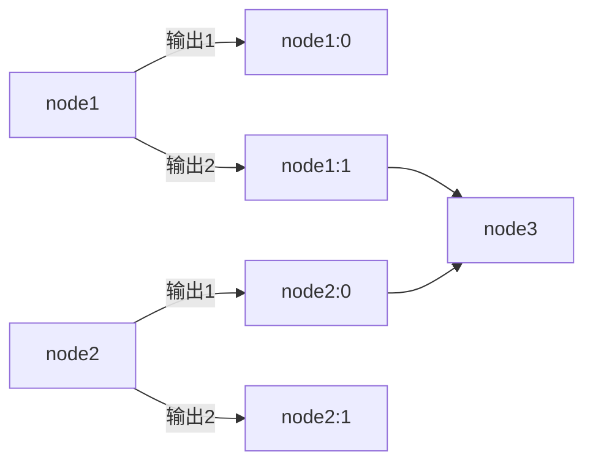
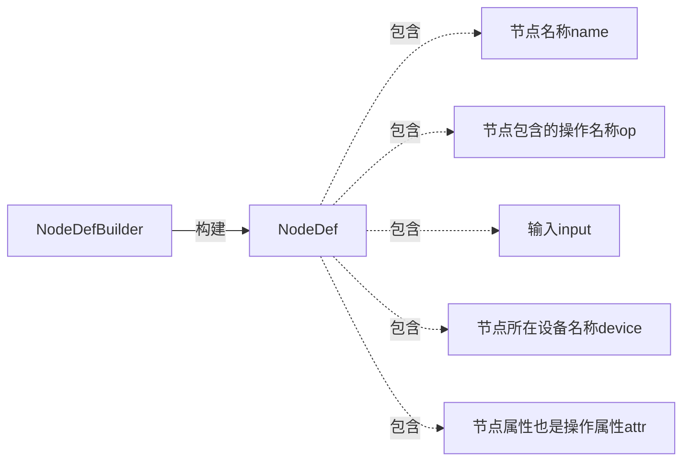

framework node
===

# node
TF中的计算图由节点组成，每个节点包含了一个操作，表示这个节点的作用，比如，如果一个节点的作用是做矩阵乘法，那么它的输入是两个矩阵，输出是两个输入矩阵相乘的结果。节点是自带结构的，每个节点都包含了输入的来源，因此若干节点的集合就能无需其它信息的生成一张图。节点必须被放置在某一个设备上，为了减少跨设备传输数据，也为了提高计算效率，节点的放置是一个受限条件下的优化问题，为此TF还专门开发了相应的节点放置算法。

# node_def
我们先来看一下节点的定义：
```c++
message NodeDef {
    string name = 1;//节点名称
    string op = 2;//节点包含的操作名称
    repeated string input = 3;//节点的输入，详见正文
    string device = 4;//节点所在的设备
    map<string, AttrValue> attr = 5;//节点包含的op，其参数的具体赋值
};
```
由于节点对于后续理解graph和kernel非常重要，因此我们详细分析一下它包含的字段：

* 关于input，刚才提到，节点是自带结构信息的，这个信息就包含在input字段中。input的格式是node:src_output，其中的node表示输入的节点名称，src_output表示该输入是输入节点的第几个输出。这样听起来可能很绕，举个例子，假设node1和node2是两个节点，它们分别产生两个输出，node1:0，node1:1，node2:0，node2:1。现在我们有第三个节点node3，它需要来自前两个节点的输出作为输入，具体需要的输入是node1:1和node2:0，那么，node3的input字段就是node1:1和node2:0，如下图所示。另外，如果需要的是输入节点的第1个输出，那么后面的端口号可以忽略，比如node2:0可以直接写为node2。



* 关于input，额外一点，节点的输入可以是真实输入，也可以是控制输入。控制输入表示节点并不需要这个输入的具体数值做计算，仅仅是为了说明一种计算的先后关系，即当前节点的计算，必须在所有的控制输入计算都完成之后进行。在表示input字段时，控制输入需要跟在常规输入的后面，并且用^node表示。
* 关于device，它表示了我们对于当前节点可以被放置的设备的需求。这个描述可以是完全限定的，比如"/job:worker/replica:0/task:1/gpu:3"，也可以是局部限定的，比如"/job:worker/gpu:3"，也可以不限定。因此这个字段指代的，可能不是某一个具体的设备，这就需要上文提到的节点放置算法，对节点所在的设备进行选择了。也就是说，device这个字段有些情况下只是给节点所在的设备限制了一个粗略的条件，节点放置算法需要在考虑这些条件的基础上，为节点选择合适的设备。关于节点放置算法的细节，我们将在后面详述。
* 关于attr，前面讲过，op是一个抽象信息，这个抽象信息包含了很多未赋值的参数，在运行时构建图的时候，这些参数就一定要被赋值了，否则图计算就无法进行。因此这里必须包含op中所有未赋值的参数的具体数值。如果op中的参数有默认值，这里可以对其进行覆盖，也可以忽略，这样该参数就会使用默认值。

按照惯例，TF会给每一个核心概念设计一个构建类，node也不例外，这个类就是NodeDefBuilder。我们先来看一下它的用法：
```c++
NodeDef node_def;
Status status = NodeDefBuilder(node_name, op_name)
                    .Input(...)
                    .Attr(...)
                    .Finalize(&node_def);
```
可见，与OpDefBuilder类似，我们也可以采用链式规则，通过逐个设置NodeDef的字段来构建它。下面我们看下NodeDefBuilder包含的私有数据：

```c++
class NodeDefBuilder {
  private:
    const OpDef* op_def_;
    NodeDef node_def_;
    int inputs_specified_;
    std::vector<string> control_inputs_;
    std::vector<string> errors_;
};
```
这里之所以会包含OpDef，是因为在NodeDef中，仅包含了操作的名称。
# 类图



# 文件

* [node_def.proto](../tensorflow/core/framework/node_def.proto)
* [node_def_util.h](../tensorflow/core/framework/node_def_util.h)
* [node_def_builder.h](../tensorflow/core/framework/node_def_builder.h)
* [node_def_properties.h](../tensorflow/core/framework/node_def_properties.h)