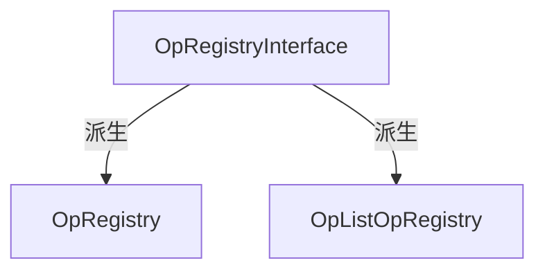
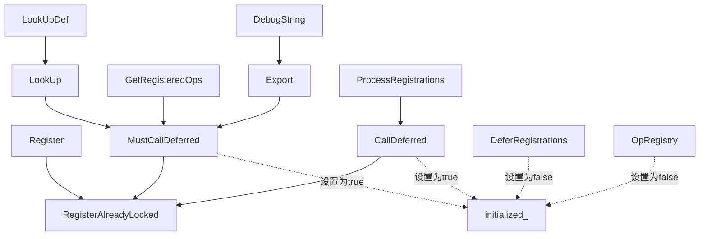
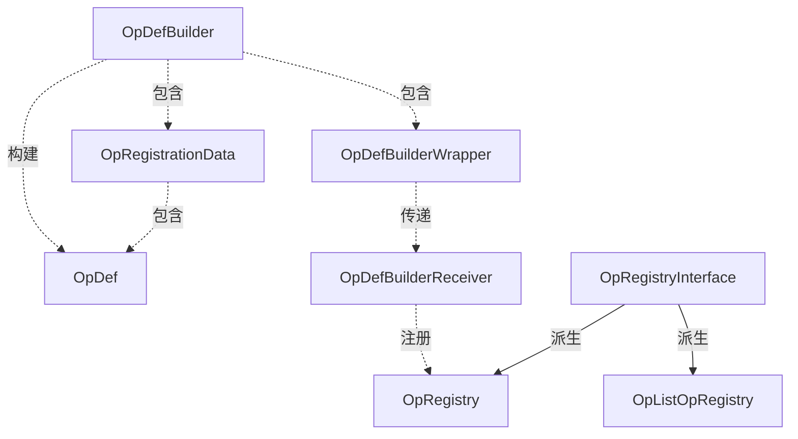

framwork op
===

# OP
op和kernel是TF框架中最重要的两个概念，如果一定要做一个类比的话，可以认为`op`相当于函数声明，`kernel`相当于函数实现。举个例子，对于矩阵相乘，我可以声明一个op叫做`MatMul`，指明它的名称，输入，输出，参数，以及对参数的限制等。`op`只是告诉我们，这个操作的目的是什么，操作内部有哪些可定制的东西，但不会提供具体实现。操作在某种设备上的具体实现方法，是由`kernel`决定的。TF的计算图由节点构成，而每个节点对应了一个`op`，在构建计算图时，我们只知道不同节点对应的操作是什么，而不知道运行时这个操作是怎样实现的。也就是说，`op`是编译期概念，而kernel是运行期概念。

那为什么要把操作和它的实现分离呢？是为了实现TF代码的可移植性。我们可以把TF构建的计算图想象为`c++`的字节码，而计算图在执行的时候，需要考虑可用的设备资源，相当于我们在运行`c++`字节码的时候，需要考虑当前所在的操作系统，选择合适的字节码实现。因为TF的目标是在多设备上运行，但我们在编码的时候，是无法预先知道某一个操作具体是在哪种设备上运行的，因此，将操作和它的实现分离，可以让我们在设计计算图的时候，更专注于它的结构，而不是具体实现。当我们构建完成一个计算图之后，在一个包含`GPU`的设备上，它可以利用对应操作在`GPU`上的`kernel`，充分利用GPU的高计算性能，在一个仅包含`CPU`的设备上，它也可以利用对应操作在`CPU`上的`kenrel`，完成计算功能。这就提高了TF代码在不同设备之间的可移植性。

# op_def定义
由于仅是操作的声明，OpDef不需要包含太多的API，它被定义在一个proto中。由于这个概念极端重要，我们在这里完整列出它的代码：
```c++
message OpDef {
    string name = 1;//操作的名称
    message ArgDef { //对输入输出的定义
        string name = 1;
        string description = 2;
        DataType type = 3;//以下4个字段说明了数据的类型，详见正文
        string type_attr = 4;
        string number_attr = 5;
        string type_list_attr = 6;
        bool is_ref = 16;//输入或输出是否为引用
    };
    repeated ArgDef input_arg = 2;//输入描述
    repeated ArgDef output_arg = 3;//输出描述
    message AttrDef {
        string name = 1;
        string type = 2;
        AttrValue default_value = 3;
        string description = 4;
        bool has_minimum = 5;
        int64 minumum = 6;
        AttrValue allowed_values = 7;
    }
    repeated AttrDef attr = 4;
    OpDeprecation deprecation = 8;
    string summary = 5;
    string description = 6;
    bool is_commutative = 18;//是否可交换，即op(a,b) == op(b,a)
    bool is_aggregate = 16;//是否可聚集
    bool is_stateful = 17;//是否带有状态
    bool allows_uninitialized_input = 19;//针对赋值操作
};
message OpDeprecation {
    int32 version = 1;
    string explanation = 2;
};
message OpList {
    repeated OpDef op = 1;
};
```
我们看到，OpDef中最核心的数据成员是操作名称、输入、输出、参数。其中的参数怎样理解呢？我们之前提到op相当于函数声明，这个函数是带参数的，具体使用该操作时，我们需要给参数赋予实际的数值，这个在接下来分析node_def时会详细讲到。

对于其中的几个难理解的点，作出说明：
* ArgDef中的3-6四个字段，是为了描述输入或输出的类型。当输入或输出是一个张量时，type或type_attr被设置为这个张量的数据类型，当输入或输出是一个由相同数据类型的张量构成的序列时，number_attr被设置为int对应的标识，当输入或输出是一个由张量构成的列表时，type_list_attr被设置为list(type)对应的标识；
* AttrDef中的has_minimum字段，表明这个属性是否有最小值，如果数据类型是int，那么minimum就是允许的最小值，如果数据类型是列表，那么minimum就是列表的最短长度；
* is_aggregate这个字段，表明当前的操作是否是可聚集的，一个可聚集的操作是，能接受任意数量相同类型和形状的输入，并且保持输出与每个输入的类型和形状相同，这个字段对于操作的优化非常重要，如果一个操作是可聚集的，并且其输入来自多个不同的设备，那么我们就可以把聚集优化成一个树形的操作，先在设备内部对输入做聚集，最后在操作所在的设备集中，这样可以提高效率。这种优化对于分布式的机器学习模型训练非常有帮助，Spark ML中的TreeAggregate就实现了这样的优化。可惜截止笔者看到的TF1.2版本，还没有实现这个优化；
* is_stateful这个字段，表明当前的操作是否是带有状态的，什么操作会带有状态呢？比如Variable；
  
为了方便进行OpDef的构建，TF还设计了OpDefBuilder类，它的私有数据成员如下：
```c++
class OpDefBuilder {
    //...
  private:
    OpRegistrationData op_reg_data_;
    std::vector<string> attrs_;
    std::vector<string> inputs_;
    std::vector<string> outputs_;
    string doc_;
    std::vector<string> errors_;
}
```
可以看到，除了errors_字段之外，其它内容几乎就是把OpDef的结构原封不动的搬了过来。这里面我们发现了一个新的结构，OpRegistrationData，它的结构如下：
```c++
struct OpRegistrationData {
  public:
    //...
    OpDef op_def;
    OpShapeInferenceFn shape_inference_fn;
}
```
在这个结构中，除了我们熟知的OpDef之外，还包含了一个OpShapeInferenceFn结构，它的定义如下：

```c++
typedef std::function<Status(shape_inference::InferenceContext* c)> OpShapeInferenceFn;
```
这个结构的定义中，涉及到了我们后面要讲到的形状推断的内容，这里我们只需要知道，OpShapeInferenceFn是一个帮助操作根据输入形状对输出形状进行推断的函数即可。

# op注册

为了方便对操作进行统一管理，TF提出了操作注册器的概念。对于核心数据的统一管理类型，我们并不陌生，回想之前介绍的ResourceMgr和AllocatorRegistry，原理如出一辙。因此，这个操作注册器的作用，就是为各种操作提供一个统一的管理接口。

操作注册类的继承结构如下：



其中，OpRegistryInterface是一个接口类，它提供了注册类最基础的查找功能：
```c++
class OpRegistryInterface {
  public:
    //...
    //操作查找方法
    virtual Status LookUp(const string& op_type_name, const OpRegistrationData** op_reg_data) const = 0;
    Status LookUpOpDef(const string& op_type_name, const OpDef** op_def) const;
}
```
OpRegistry就是操作注册器，它的核心接口和数据如下：

```c++
class OpRegistry : public OpRegistryInterface {
  public:
    typedef std::function<Status(OpRegistrationData*)> OpRegistrationFactory;
    void Register(const OpRegistrationDataFactory& op_data_factory);//操作注册
    static OpRegistry* Global();//返回一个全局静态对象
    typedef std::function<Status<const Status&, const OpDef&)> Watcher;
    Status SetWatcher(const Watcher& watcher);
  private:
    mutable mutex mu_;
    mutable std::vector<OpRegistrationDataFactory> deferred_ GUARDED_BY(mu_);
    mutable std::unordered_map<string, const OpRegistrationData*> registry_ GUARDED_BY(mu_);
    mutable bool initialized_ GUARDED_BY(mu_);
    mutable Watcher watcher_ GUARDED_BY(mu_);
}
```
这里面有几个有意思的地方：
* 注册函数Register的输入，是一个函数引用，这个函数接收一个OpRegistrationData指针作为输入，那么这个函数引用的作用究竟是什么呢？它的源代码如下，原来，我们先建立了一个OpRegistrationData的对象，然后将它作为参数传入op_data_factory函数，这个函数会帮我们填充对象的内容，然后再用这个对象的信息进行注册；
```c++
Status OpRegistry::RegisterAlreadyLocked(const OpRegistrationDataFactory& op_data_factory) const {
    std::unique_ptr<OpRegistrationData> op_reg_data(new OpRegistrationData);
    Status s = op_data_factory(op_reg_data.get())
    //...
}
```
* Watcher是一个监视器，每次当我们注册了一个操作的时候，在注册步骤的最后都要调用一下这个Watcher函数，它可以方便我们对注册的操作进行监控，所有的操作注册动作都逃不过它的眼睛，我们可以根据自己的需要定制Watcher；
* registry_是已注册的操作真正存放的位置，它的结构很简单，是一个操作名到操作数据的映射；
* initialized_和deferred_是与注册模式相关的两个数据成员，注册模式的概念接下来将会详细阐述；

注册器在注册操作时，分为两种模式，一种是即时注册模式，一种是懒惰注册模式。注册模式通过initialized_字段区分，true表示即时注册模式，false表示懒惰注册模式。在懒惰注册模式中，带注册的操作先被保存在deferred_向量中，在特定的函数调用时再将deferred_中的操作注册到registry_，而即时注册模式下，待注册的操作不用经过deferred_，直接注册到registry_。设计懒惰注册模式的原因是，我们希望部分操作组合的注册是原子的，即要么全部注册，要么全部不注册，因为这些操作之间可能会有相互依赖关系。

为了更加透彻的理解注册模式的转换，我们绘制了OpRegistry类中，与注册相关的函数的调用关系，以及对initialized_的修改如下：

构造函数将initialized_设置为false，进入懒惰注册模式，随后一旦调用了MustCallDeferred或者CallDeferred中的任意一个，都会将initialized_设置为true，进入即时注册模式。想要重新返回懒惰注册模式也很简单，只需要调用DeferRegistrations即可。

最后简单介绍一下OpListRegistry，它允许我们用OpList初始化一个注册器，请注意，OpList仅仅是OpDef的列表，它并不包含形状推断函数这个信息，因此这个注册器中的操作，是不包含形状推断函数的。如果我们要查找的操作不需要形状推断函数，就可以使用这个注册器。它的私有数据如下：

```c++
class OpListOpRegistry : public OpRegistryInterface {
  public:
    //...
  private:
    std::unordered_map<string, const OpRegistrationData*> index_;
}
```
# op构建与注册辅助结构
为了方便对操作的注册，TF提出了专为注册操作的宏，举例如下：
```c++
REGISTER_OP("my_op_name")
    .Attr("<name>:<type>")
    .Attr("<name>:<type>=<default>")
    .Input("<name>:<type-expr>")
    .Output("<name>:<type-expr>")
    .Doc(R"(
        <1-line summary>
        <rest of the description (potensitally many lines)>
...
)");
```
这种写法大大方便了注册操作的过程。但想要实现这种宏操作，目前的类还满足不了。TF设计了两个类来实现这个功能，一个类为op的构建提供链式语法支持，另外一个类接受op构建结果，提供操作注册功能。这两个类分别是OpDefBuilderWrapper和OpDefBuilderReceiver。我们先来看前者：
```c++
class OpDefBuilderWrapper<true> {
  public:
    OpDefBuilderWrapper(const char name[]) : builder_(name){}
    OpDefBuilderWrapper<true>& Attr(StringPiece spec){
        builder_.Attr(spec);
        return *this;
    }
    //...
  private:
    mutable ::tensorflow::OpDefBuilder builder_;
}
```
有两点比较有意思，首先顾名思义这个类基本上是对OpDefBuilder的一个封装，提供了几乎完全一致的API；其次，它的API都是设置型，且都返回对象本身，这就为链式的属性设置提供了可能。值得注意的是，这个类名后面跟着一个true，它的含义我们待会儿揭晓。
再来看看OpDefBuilderReceiver：
```c++
struct OpDefBuilderReceiver {
    OpDefBuilderReceiver(const OpDefBuilderWrapper<true>& wrapper);
    constexpr OpDefBuilderReceiver(const OpDefBuilderWrapper<false>&){}
};
```
它提供的构造函数，以OpDefBuilderWrapper作为输入参数，也就是说，我们可以通过赋值构造把后者直接赋值给前者，看下REGISTER_OP的宏定义：
```c++
//为了忽略不必要的细节，以下代码做了适当删减
#define REGISTER_OP(name) REGISTER_OP_UNIQ_HELPER(__COUNTER__, name)
#define REGISTER_OP_UNIQ_HELPER(ctr, name) REGISTER_OP_UNIQ(ctr, name)
#define REGISTER_OP_UNIQ(ctr, name) \
    static OpDefBuilderReceiver register_op##ctr = OpDefBuilderWrapper<SHOULD_REGISTOR_OP(name)>(name)
```
我们发现，REGISTER_OP绕了一圈，最终就是先用OpDefBuilderWrapper对操作进行封装，然后把它作为参数传递给OpDefBuilderReceiver的构造函数，而在这个构造函数中，完成了对操作的注册：
```c++
OpDefBuilderReceiver::OpDefBuilderReceiver(const OpDefBuilderWrapper<true>& wrapper) {
    OpRegistry::Global()->Register([wrapper](OpRegistrationData* op_reg_data) -> Status {
        return wrapper.builder().Finalize(op_reg_data);
        });
    }
}
```
最后我们来解释下刚才卖的关子，OpDefBuilderWrapper<true>后面的这个true到底代表什么。我们知道，TF为我们准备了很多的操作，但有些时候我们可能用不着这所有的操作，仅需要其中一部分。如果不加限制全部编译，会给我们的运行时库带来很大的负担。因此，TF允许我们添加一个头文件，用宏SHOULD_REGISTOR_OP定义我们想要导出的操作，比如：
```c++
#define SHOULD_REGISTOR_OP(Add) true
#define SHOULD_REGISTOR_OP(Subtract) false
```
表示我们希望导出Add操作，但希望屏蔽Subtract操作。这样就能够根据需要定制自己的TF运行时库了。因此源代码中除了这个OpDefBuilderWrapper<true>类之外，还有一个OpDefBuilderWrapper<false>类，最后，有些操作系统是必须要导出的，比如一些内部操作，TF为此设计了另外一个宏，可以无视SHOULD_REGISTOR_OP的宏定义，感兴趣的读者可以去看下源代码。

# op重写
随着TF的不断拓展，操作本身也在不断的迭代，比如重命名。为了与已有的图实现向前兼容，TF提出了OpGenOverrides的结构，如下：
```c++
message OpGenOverride {
    string name = 1;
    bool skip = 2;//直接废弃这个操作
    bool hide = 3;//对外隐藏
    string rename_to = 4;
    repeated string alias = 5;//更新API的名称
    message AttrDefault {
        string name = 1;
        AttrValue value = 2;
    }
    repeated AttrDefault attr_default = 6;//修改参数默认值
    message Rename {
        string from = 1;
        string to = 2;
    }
    repeated Rename attr_rename = 7;
    repeated Rename input_rename = 8;
    repeated Rename output_rename = 9;
}
message OpGenOverrides {
    repeated OpGenOverride op = 1;
}
```
具体的替换操作是由OpGenOverrideMap这个类实现的，它读入一系列包含OpGenOverrides proto的文本文件，然后允许你查找针对每个已有操作的迭代：
```c++
class OpGenOverrideMap {
  public:
    Status LoadFile(Env* env, const string& filenames);
    const OpGenOverride* ApplyOverride(OpDef* op_def) const;
  private:
    std::unordered_map<string, std::unique_ptr<OpGenOverride>> map_;
};
```

# 类图



# 文件

* [op.h](../tensorflow/core/framework/op.h)
* [op_def_builder.h](../tensorflow/core/framework/op_def_builder.h)
* [op_def.h](../tensorflow/core/framework/op_def.h)
* [op_gen_lib.h](../tensorflow/core/framework/op_gen_lib.h)
* [op_gen_overrides.h](../tensorflow/core/framework/op_gen_overrides.h)