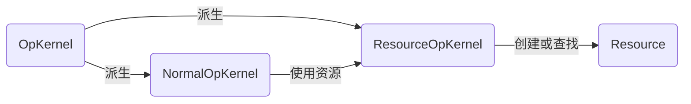
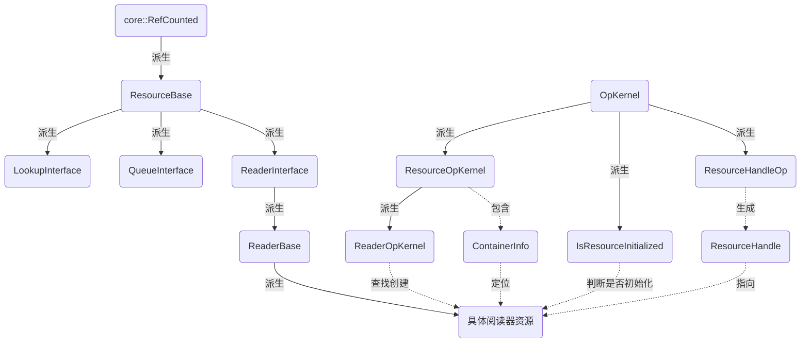

resource
===

# 什么是resource

我们知道，TF的计算是由设备完成的。每个设备包含若干个节点，由这些节点完成实际的计算。有些时候，我们需要在不同的节点之间，共享一些内容，比如，张量值，kv存储表，队列，读取器等等，这些被同设备上的节点共享的内容，就是资源。
所有的资源类都继承自一个基类，ResourceBase，下面看下它的实现：
```c++
class ResourceBase : public core::RefCounted {
public:
    virtual string DebugString() = 0;
    virtual int64 MemoryUsed() const {return 0;};
};
```
它继承自`core::RefCounted`，也就是说，资源本身拥有引用计数的功能。这是为了方便对资源的使用进行监控，在资源无用后能够及时将它释放掉。

# 如何使用resource
普通节点是无法直接使用共享资源的，必须通过一种包含了ResourceOpKernel的特殊节点（关于OpKernel的详细定义，请参见Kernel，目前仅需要知道，这是节点中用于实际执行计算的类就好了），这种节点帮助普通节点在资源管理器中查找或创建某种特定类型的资源，如图所示：


ResourceOpKernel类的定义如下（仅保留接口）：
```c++
template <typename T>
class ResourceOpKernel : public OpKernel {
  public:
    //...
    void Compute(OpKernelContext* context) override LOCKS_EXCLUDED(mu_);
  protected:
    mutex mu_;
    ContainerInfo cinfo_ GUARDED_BY(mu_);//包含了对资源的要求
    T* resource_ GUARDED_BY(mu_) = nullptr;
  private:
    virtual Status CreateResource(T** resource) EXECLUSIVE_LOCKS_REQUIRED(mu_) = 0;//返回一个T派生类的资源对象，这个对象归当前的ResourceOpKernel对象所有
    virtual Status VerifyResource(T* resource);//校验resource是否是当前对象需要的类型
    PersistentTensor handle_ GUARDED_BY(mu_);
}
```
其中的Compute函数，在首次调用时，会根据cinfo_中包含的对资源的要求，从资源管理器中查找，或者创建一个新的资源。
这里牵扯到两个新的概念，一个是ContainerInfo，一个是资源管理器。我们将在下文中讨论。

# 如何管理resource

最简单的，可以在设备内维护一个资源名称到资源实体的映射，但这种管理方式过于粗糙，TF使用容器的概念实现了对资源的分组，下面看一下对容器的定义：

```c++
typedef std::pair<uint64,string> Key;
typedef std::unordered_map<Key,ResourceBase*,KeyHash,KeyEqual> Container;
```

其中，Key是对资源的描述，uint64代表资源类型的哈希值，string代表了资源的名称，而Container本质上就是一个资源描述到资源指针的映射。
为了对同一个设备上的资源提供统一的管理入口，TF定义了ResourceMgr类，其私有数据成员如下：
```c++
class ResourceMgr {
  private:
    //当前设备上的默认容器名称，如果查找时没有指定容器，则在默认容器中查找
    const string default_container_;
    mutable mutext mu_;
    //容器名称到容器指针的映射
    std::unordered_map<string,Container*> containers_ GUARDED_BY(mu_);
    //资源类型的哈希值到资源类型名称的映射
    std::unordered_map<uint64,string> debug_type_names GUARDED_BY(mu_);
};
```
资源管理类的公共接口如下：
```c++
class ResourceMgr {
public:
    //在container容器中创建一个名为name的资源
    Status Create(const string& container, const string& name, T* resource);
    //在container中查找一个名为name的资源
    Status Lookup(const string& container, const string& name, T** resource) const;
    //如果container中包含名为name的资源，填充到*resource中，否则，使用creater()创建一个资源
    Status LookupOrCreate(const string& container, const string& name, T** resource, std::function<Status(T**)> creater);
    //删除container中的名为name的资源
    Status Delete(const string& container, const string& name);
    //删除句柄handle指向的资源
    Status Delete(const ResourceHandle& handle);
    //删除container中的所有资源，并删除该container
    Status Cleanup(const string& container);
    //删除所有容器中的所有资源
    void Clear();
};
```
注释很清晰，这里就不再赘述了。
刚才提到，为了让ResourceOpKernel类的对象能够找到对应的资源，它在内部包含了一个ContainerInfo的类，它的作用是，帮助一个有状态的OpKernel决定，它需要通过哪个container/shared_name组合来访问对应的资源，类的定义如下：

```c++
class ContainerInfo {
  public:
    Status Init(ResourceMgr* rmgr, const NodeDef& ndef, bool use_node_name_as_default);
  private:
    ResourceMgr* rmgr_ = nullptr;
    string container_;
    string name_;
    bool resource_is_private_to_kernel_ = false;
};
```
其中，这个决策过程如下：

* 如果这个NodeDef的属性中，包含了"container"，就使用这个容器名称，否则使用rmgr的默认容器；
* 如果这个NodeDef的属性中，包含了"shared_name"，那么就以此作为资源的名称，否则，如果"use_node_name_as_default"为真，则使用节点名称作为资源名称，如果为假，则生成一个唯一标识作为资源名；

可见，`ContainerInfo`本质上提供的是，如何帮助节点找到资源的位置，而不是资源位置的静态描述。为了方便指向资源，TF提出了资源句柄的概念，它的protobuf定义如下：
```c++
message ResourceHandleProto {
    //资源所在设备
    string device = 1;
    //资源所在容器
    string container = 2;
    //资源名称
    string name = 3;
    //资源类型的哈希值
    uint64 hash_code = 4;
    //资源类型名称，仅调试用
    string maybe_type_name = 5;
}
```
资源句柄提供了对于资源位置和属性的详细描述，通过句柄我们可以唯一定位到一个资源。由于这个资源句柄是可序列化的，因此我们可以方便的传递它。另外为了避免使kernel依赖于proto，TF还设计了一个与ResourceHandleProto拥有相同功能的类，ResourceHandle，详见源代码。

# 常用resource
本篇的开头提到了，常用的资源包括张量值，kv存储表，队列，读取器等等，除了张量值之外，TF为后三者提供了应用的接口，如下：
```c++
class LookupInterface : public ResourceBase;
class QueueInterface : public ResourceBase;
class ReaderInterface : public ResourceBase;
```
其中:
* kv存储器接口LookupInterface提供了一个批量查找和插入kv存储器的接口，方便不同的计算节点之间共享kv数据；
* 队列接口QueueInterface提供了入队、出队等接口，方便不同节点之间共享队列，这对于计算图的异步执行是非常重要的，读取器接口内部也用到了队列接口；
* 读取器接口ReaderInterface是所有TF支持的文件读取器的统一接口。TF可以支持从不同格式的文件中读取数据，每一个文件读取器都是一种资源，都需要继承自ReaderInterface接口；

其中，关于读取器接口，其实真正的读取器资源，并非直接继承自读取器接口，而是继承自它的一个派生类，ReaderBase，这个类为读取器接口的每一个API提供了一个默认的实现，它的派生类只要重写这些默认实现，就能完成对不同文件格式的读取。
同时，为了方便获取读取器资源，TF还为ResourceOpKernel生成了一个专用于获取读取器接口的派生类`ReaderOpKernel`：
```c++
class ReaderOpKernel : public ResourceOpKernel<ReaderInterface>;
```
这个类用于查找或者创造读取器资源，而这些读取器资源需要派生自ReaderBase类。

# 其他结构
为了方便对资源进行操作，TF除了设计`ResourceOpKernel`这个核之外，还设计了两种核，`IsResourceInitialized`和`ResourceHandleOp`，前者用于检查某个资源是否已经初始化，后者用于为某个资源生成资源句柄。具体定义可以查看源代码。

# 关系图



# 文件

* [resource_handle.h](../tensorflow/core/framework/resource_handle.h)
* [resource_mgr.h](../tensorflow/core/framework/resource_mgr.h)
* [resource_op_kernel.h](../tensorflow/core/framework/resource_op_kernel.h)
* [lookup_interface.h](../tensorflow/core/framework/lookup_interface.h)
* [queue_interface.h](../tensorflow/core/framework/queue_interface.h)
* [reader_interface.h](../tensorflow/core/framework/reader_interface.h)
* [reader_base.h](../tensorflow/core/framework/reader_base.h)
* [reader_op_kernel.h](../tensorflow/core/framework/reader_op_kernel.h)