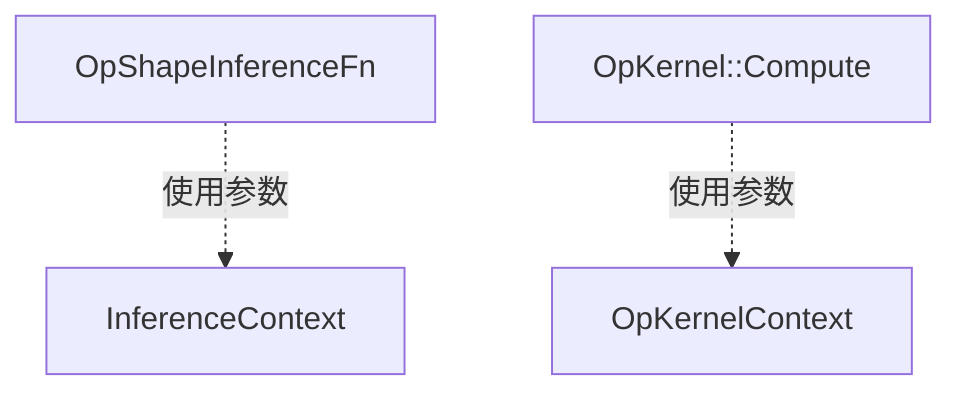

framework shape_inference
===

# shape inference    

前面我们讲到op的时候，提到了操作的注册器OpRegistry，并且提到，其中注册的数据是一个结构OpRegistrationData，这个结构中除了OpDef之外，还包含了一个OpShapeInferenceFn，这个数据是做什么用的呢？
我们知道，op只是定义了操作的输入输出和参数，但并没有定义操作具体的输入形状，举个例子，MatMul操作，代表矩阵乘法，这只是一个抽象的表示，没有具体说，这个矩阵乘法代表的是[2,3]x[3,4]=[2,4]，还是[100,200]x[200,300]=[100,300]。所以在实际应用中，在得到输入之前，输出的真实形状是无法预知的，但在得到输入之后，我们必须能够根据输入的形状，以及当前op的作用，判断输出的具体形状，才能给它申请对应大小的内存空间。所以，我们需要为每一个操作，配备一个形状推断的函数，这就是形状推断的由来。

#  InferenceContext

前面提到了`OpShapeInferenceFn`，我们来看一下它的详细定义：
```c++
typedef std::function<Status(shape_inference::InferenceContext* c)> OpShapeInferenceFn;
```
可见，OpShapeInferenceFn是一个接收InferenceContext参数的函数，TF为所有op的形状推断函数，准备了这样一个统一的接口。所有跟形状推断相关的数据和功能函数，都放在InferenceContext这个类的内部。回想一下前面讲过的OpKernelContext，其实它们的功能很像。OpKernelContext是作为OpKernel的核心API Compute函数的参数，所有计算相关的参数都会包含在这个对象中。InferenceContext也是一样，我们把所有跟形状推断相关的数据和功能函数封装在一个InferenceContext对象中，然后把这个对象传递给OpShapeInferenceFn，就可以实现形状推断。这种设计实现了数据部分和实现逻辑的解耦。

在具体看ShapeInference类之前，我们先要看一些辅助类：
```c++
class Dimension {
  private:
    //...
    const int64 value_;
};
class DimensionHandle {
  private:
    //...
    const Dimension* ptr_ = nullptr;
};
class Shape {
    //...
  private:
    const int32 rank_;
    const std::vector<DimensionHandle> dims_;
};
class ShapeHandle {
    //...
  private:
    const Shape* ptr = nullptr;
};
class DimensionOrConstant {
  public:
    //...
    DimensionHandle dim;
    int64 val;
};
class ShapeAndType {
    ShapeHandle shape;
    DataType dtype = DT_INVALID;
};
```
这几个类都比较简单。在下面用到时能够认得就好了。
下面我们看下InferenceContext这个类：
```c++
class InferenceContext {
  public:
    InferenceContext(int graph_def_version, const NodeDef* node_def, const OpDef& op_def, const std::vector<ShapeHandle>& input_shapes, const std::vector<const Tensor*>& input_tensors, const std::vector<ShapeHandle>& input_tensors_as_shapes, std::vector<std::unique_ptr<std::vector<ShapeAndType>>> input_handle_shapes_and_types);//构造函数
    Status Run(const std::function<Status(shape_inference::InferenceContext* c)>& fn);//运行一个以this为参数的函数，没错，这里运行的就是OpShapeInferenceFn
    bool MergeInput(int idx, ShapeHandle shape);
    bool RelaxInput(int idx, ShapeHandle shape);
  private:
    ShapeManager shape_manager_;
    std::vector<ShapeHandle> inputs_;
    std::vector<const Tensor*> input_tensors_;
    std::vector<bool> requested_input_tensor_;
    std::vector<ShapeHandle> outputs_;
    std::vector<ShapeHandle> input_tensors_as_shapes_;
    std::vector<bool> requested_input_tensor_as_partial_shape_;
    std::vector<std::unique_ptr<std::vector<ShapeAndType>>> input_handle_shapes_and_types_;
    std::vector<std::unique_ptr<std::vector<ShapeAndType>>> output_handle_shapes_and_types_;
    const int graph_def_version_;
    const NodeDef& node_def_;
    NameRangeMap input_name_map_;
    NameRangeMap output_name_map_;
    Status construction_status_;
};
```
前面已经介绍过了这个类的作用，是作为真正的形状推断函数的参数，为形状推断提供足够的数据和功能函数支持，那么这个类的成员就比较清晰了，私有数据成员为形状推断提供数据支持，而公有API，为形状推断提供公用的功能函数，比如上面提到的MergeInput和RelaxOutput，下面我们重点介绍下这两个函数的功能：

MergeInput函数是将输入索引idx处的输入与shape合并，具体的合并规则是：

* 如果ShapeHandles是一样的，或者shape是未知的，那么输入维度不变。否则，如果输入维度是未知的，那么输出是shape；
* 如果两个形状都是已知的，它们必须拥有相同的rank；
*对于任意一个维度，如果在两个形状中这个维度都已知，那么它们必须相等；
* 如果一个形状在任意维度上的信息都多于另一个形状，那么拥有更多信息的形状将被返回。否则，一个新的形状将被构建并返回，这个新的形状综合了输入的两个形状的信息；
* 比如，合并[2,?]和[?,2]将得到[2,2]；
* 比如，[2,2]不能被合并到[1,2]

如果说MergeInput函数对输入形状是“收缩”的，那么“RelaxInput”函数对输入形状就是“扩张”的，它倾向于让形状变的更模糊，具体的规则是：

* 如果ShapeHandles是一样的，那么对应的shape将会被返回；
* 如果任一个ShapeHandle是未知的，那么一个未知的ShapeHandle将会被返回；
* 如果两个形状的rank已知，但不同，那么一个未知ShapeHandle将会被返回；
* 对于任一维度，如果任一shape是未知的，那么对应的输出维度也是未知的；
* 对于任一维度，如果两个shape对应的维度位置都是已知的，但并不相同，那么对应的输出维度也是未知的；
* 如果两个shape的rank和对应维度大小都一样，那么这个形状将会被返回；
* 例如，[2,?]和[?,2]会得到[?,?]；
* 例如，[2,2]和[3,2]会得到[?,2]；
* 例如，[2,2]和[1,2,3]会得到

# 类图



# 文件

* [shape_inference.h](../tensorflow/core/framework/shape_inference.h)